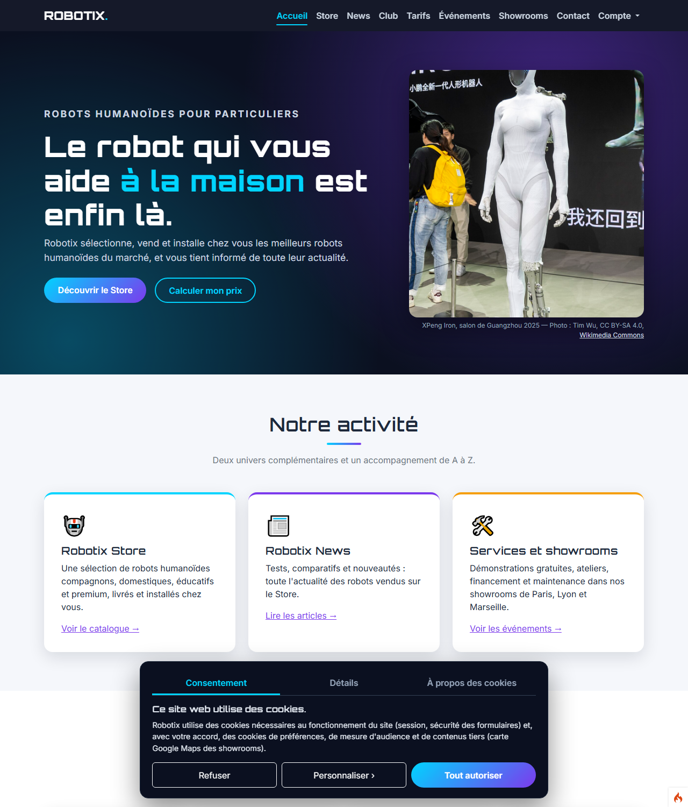
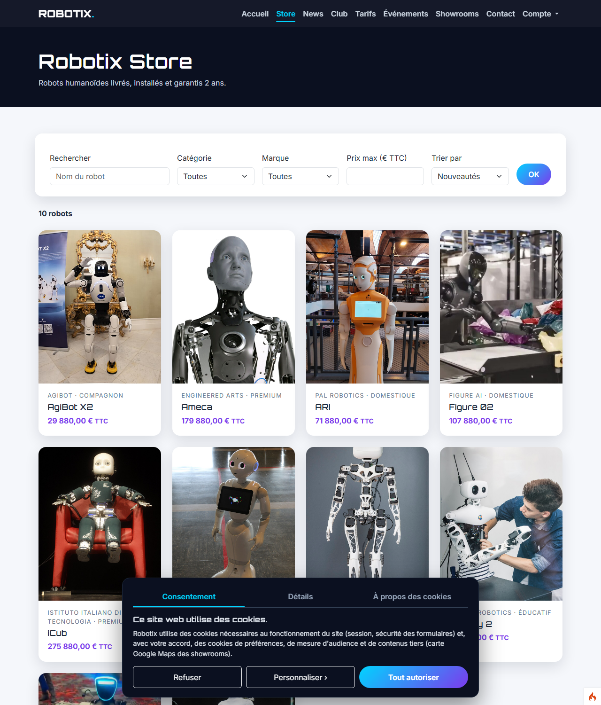
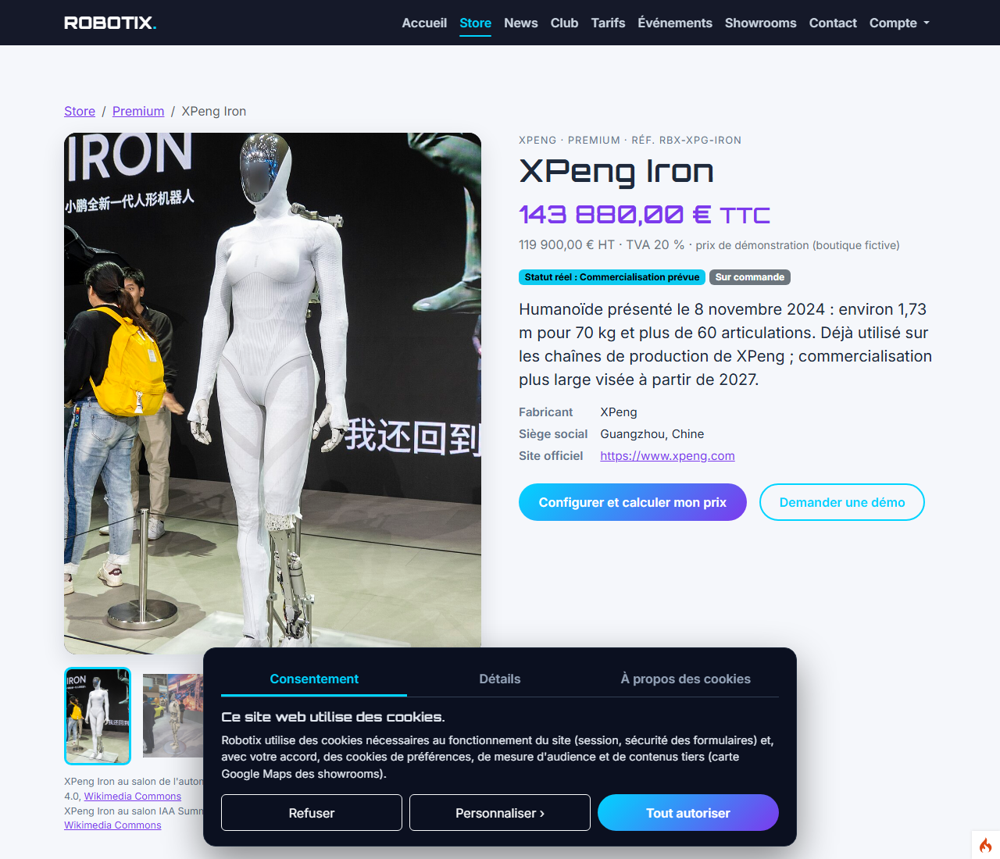

# Robotix19

Boutique **fictive** de robots humanoïdes **réels** pour les particuliers, avec son club : un projet de BTS SIO, option SLAM, réalisé avec **CodeIgniter 4** et **SQL Server**.



## Le vrai et le fictif

| Réel et vérifié | Fictif (pour la démonstration) |
|---|---|
| 10 robots humanoïdes (Unitree G1, Figure 02, Reachy 2, Pepper, XPeng Iron, Ameca, AgiBot X2, ARI, Poppy, iCub), leurs caractéristiques et leur statut commercial | La boutique Robotix, ses prix et ses stocks |
| Les 10 marques : siège social, année de création, site officiel | Les showrooms de Lyon, Paris et Marseille |
| Les photos, sous licence libre (Wikimedia Commons), avec leurs crédits | Le club, ses membres, ses animateurs et ses événements |

Les sources de chaque information sont listées dans [`docs/sources-robots.md`](docs/sources-robots.md).

## Fonctionnalités

**Robotix Store et vitrine**
- Catalogue filtrable, fiche robot avec anatomie interactive (`<map>`/`<area>`), galerie et crédits photos
- Calculateur de prix en JavaScript : options, quantité, financement
- Planning des événements par mois, cartes Google Maps des showrooms, formulaire de contact contrôlé
- Bandeau de consentement aux cookies (RGPD) : Google Maps ne se charge qu'après accord

**Club Robotix**
- Inscription avec mot de passe haché, formule d'adhésion et prix réduit selon la catégorie d'âge
- Espace membre (inscription aux événements, événements suivis) et espace animateur (présences, travail réalisé)
- Remplacement des animateurs (relation réflexive) ; panier de réservations enregistré en base

**Administration**
- Planning (CRUD avec contrôle des chevauchements), adhérents, statistiques, animateurs
- Rapports SQL Server : 5 procédures stockées, 3 déclencheurs, 2 vues
- Journal des actions, réinitialisation du jeu de démonstration

**Sécurité**
- Limite des tentatives de connexion (5 par compte, 20 par adresse IP, blocage de 15 minutes)
- Mot de passe oublié : lien à usage unique valable 1 heure, seule l'empreinte SHA-256 du jeton est stockée
- Jeton CSRF, requêtes préparées, en-têtes de sécurité, contrôle des fichiers envoyés

| Store | Fiche robot |
|---|---|
|  |  |

## Technologies

- **Serveur** : PHP 8.1, CodeIgniter 4.6 (MVC, filtres, Query Builder), couche PDO (`pdo_sqlsrv`)
- **Base de données** : SQL Server 2022 — migrations, procédures stockées, déclencheurs et vues en T-SQL
- **Interface** : HTML5 validé W3C, Bootstrap 5.3, CSS personnel, JavaScript sans bibliothèque
- **Tests** : PHPUnit 10 (plus de 260 tests, chacun dans une transaction annulée) et `node:test` pour le JavaScript

## Installation

Prérequis :
- PHP 8.1 ou plus, avec les extensions `sqlsrv`, `pdo_sqlsrv`, `intl` et `mbstring` ;
- Composer ;
- SQL Server avec une base vide (par exemple `Robotix58`).

1. Installer les dépendances :

   ```bash
   composer install
   ```

2. Créer un fichier `.env` à la racine avec la connexion à la base (ce fichier n'est jamais publié) :

   ```ini
   CI_ENVIRONMENT = development

   database.default.hostname = MON-SERVEUR
   database.default.database = Robotix58
   database.default.username = mon_utilisateur
   database.default.password = mon_mot_de_passe
   database.default.DBDriver = SQLSRV
   database.default.port     = 1433
   database.default.charset  = utf8
   ```

   Le charset doit valoir `utf8` : avec `utf8mb4`, les accents sont mal enregistrés par SQL Server.

3. Créer les tables et le jeu d'essai :

   ```bash
   php spark migrate
   php spark db:seed RobotixSeeder
   ```

4. Lancer le site :

   ```bash
   php spark serve
   ```

   Pour servir le site sur un autre port (8080 par exemple), définir aussi `app_baseURL=http://localhost:8080/` dans l'environnement.

Les dates du jeu d'essai sont décalées automatiquement sur la semaine en cours : les événements restent toujours à venir. Avant une présentation, utilisez **Compte → Jeu de démonstration → Réinitialiser la démo**.

## Comptes de démonstration

Mot de passe commun : `Robotix2026!`. La connexion se fait par e-mail ou par pseudo.

| Rôle | Identifiant |
|---|---|
| Administrateur | `admin@robotix.test` |
| Animateur | `karim.h` |
| Membre du club | `camille` |
| Client hors club | `jules.moreau@exemple.fr` |

## Tests et qualité

Pour lancer les tests, copier `phpunit.xml.dist` en `phpunit.xml` et y renseigner la base de test.

```bash
php vendor/bin/phpunit --no-coverage    # tests PHP (base réelle, transactions annulées)
node --test "tests/js/*.test.js"        # tests JavaScript
powershell -ExecutionPolicy Bypass -File tools\w3c.ps1 -base http://localhost:8080/   # validation W3C
powershell -ExecutionPolicy Bypass -File tools\sauvegarde-sql.ps1                     # script SQL de la base
```

## Documentation

- Recettes (critères des grilles et manipulations) : [AP1](docs/recette-ap1.md), [AP2](docs/recette-ap2.md), [AP3](docs/recette-ap3.md)
- Modèle conceptuel des données : [`docs/mcd-robotix.md`](docs/mcd-robotix.md) ; diagramme du club : [`docs/diagramme-ap3.md`](docs/diagramme-ap3.md)
- Script SQL complet : [`docs/sql/robotix58.sql`](docs/sql/robotix58.sql)
- Page « À propos du projet » dans le site : `/a-propos`

## Crédits

- Photos de robots : Wikimedia Commons, licences CC0, CC BY et CC BY-SA. L'auteur et la licence de chaque photo sont indiqués sur la page `/credits` du site.
- Framework : [CodeIgniter 4](https://codeigniter.com), licence MIT. Le fichier [`LICENSE`](LICENSE) est celui du framework.
- Projet réalisé par Ihab Benmahrouz, BTS SIO option SLAM.
