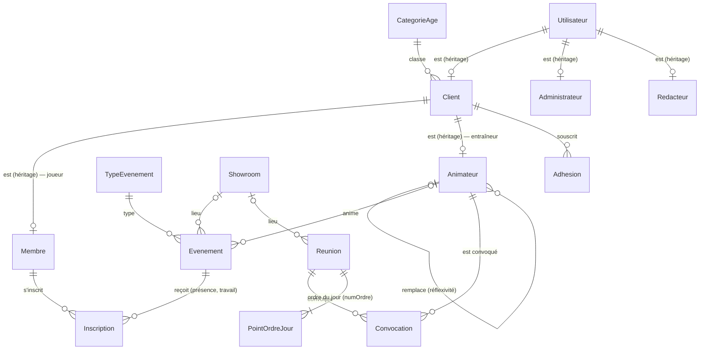

# Diagramme de la base Robotix58 — Club Robotix (AP3)

À reproduire dans SSMS (Robotix58 → Diagrammes de base de données → Nouveau diagramme) en ajoutant les tables ci-dessous.

## Tables ajoutées par l'AP3

| Table | Clé primaire | Clés étrangères | Remarques |
|---|---|---|---|
| Membre | idUtilisateur | → Client | niveau (débutant, intermédiaire, confirmé), nbEvenements tenu par déclencheur |
| Animateur | idUtilisateur | → Client ; idRemplacant → Animateur | un animateur ne se remplace pas lui-même |
| TypeEvenement | code | | demo, lancement, salon, atelier |
| Inscription | (idMembre, idEvenement) | → Membre, → Evenement | present NULL = non pointé ; travailRealise |
| Reunion | idReunion | idShowroom → Showroom | |
| Convocation | (idReunion, idAnimateur) | → Reunion, → Animateur | table de relation |
| PointOrdreJour | (idReunion, numOrdre) | → Reunion | liste ordonnée |
| MailAEnvoyer | idMail | | rempli par `trg_Inscription_Mail` |
| HistoriqueAdhesion | idHistorique | (aucune, volontairement) | rempli par `trg_Utilisateur_Historisation` |

Colonnes ajoutées : `Utilisateur.pseudo` (unique si renseigné), `Evenement.idAnimateur`, et `Evenement.type` devient une clé étrangère vers `TypeEvenement`.

## Jeu d'essai

`php spark db:seed RobotixSeeder` : 3 animateurs (Karim ← remplacé par Inès, Inès ← Théo, Théo ← Karim), 9 membres, 15 événements dont 3 passés en septembre 2026, 17 inscriptions (présents, absents, non pointés), 2 réunions avec convocations et ordre du jour.
