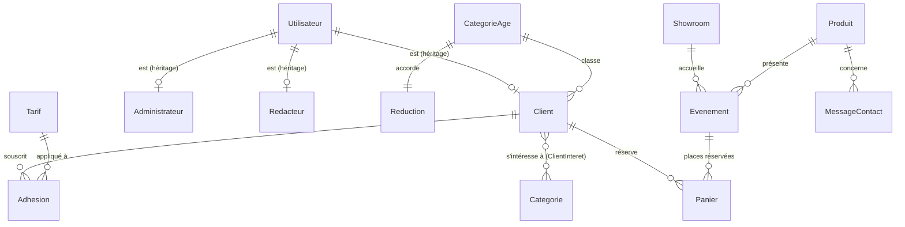

# MCD du Club Robotix (AP2)

À reproduire dans Looping. Les tables marquées « existante » viennent de Robotix58 ; les autres sont ajoutées par la migration `CreateClubRobotix`.

## Dictionnaire des données ajoutées

| Table | Colonne | Type | Contraintes |
|---|---|---|---|
| CategorieAge | idCategorieAge | INT | PK, identité |
| | libelle | VARCHAR(30) | unique |
| | ageMin, ageMax | INT | ageMin ≤ ageMax |
| Reduction | idReduction | INT | PK, identité |
| | idCategorieAge | INT | FK, unique |
| | txReduction | DECIMAL(5,2) | 0 à 100 |
| Tarif | idTarif | INT | PK, identité |
| | code | VARCHAR(30) | unique |
| | libelle | VARCHAR(80) | |
| | famille | VARCHAR(10) | formule ou option |
| | mode | VARCHAR(12) | fixe ou pourcentage |
| | valeur | DECIMAL(10,2) | ≥ 0 |
| Adhesion | idAdhesion | INT | PK, identité |
| | idUtilisateur | INT | FK Client |
| | annee | INT | unique avec idUtilisateur |
| | dateAdhesion | DATETIME | défaut GETDATE() |
| | idTarif | INT | FK Tarif |
| | montant | DECIMAL(10,2) | ≥ 0 |
| ClientInteret | idUtilisateur, idCategorie | INT | PK composée, FK |
| Panier | idPanier | INT | PK, identité |
| | idEvenement | INT | FK Evenement |
| | idUtilisateur | INT | FK Client |
| | nomEvenement | VARCHAR(150) | |
| | dateResa | DATETIME | défaut GETDATE() |
| | nbPlace | INT | > 0 |
| Client (existante) | dateNaissance, photo, idCategorieAge | DATE, VARCHAR(255), INT | ajoutées, FK CategorieAge |
| Evenement (existante) | nbPlaces | INT | défaut 30, ≥ 0 |

## Règles de gestion

Voir la spec AP2 §2 (RG1 à RG7).
