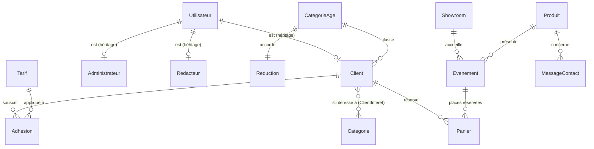

# Robotix19 — AP2 « Dynamisation » : plan d'implémentation

> **For agentic workers:** REQUIRED SUB-SKILL: Use superpowers:subagent-driven-development (recommended) or superpowers:executing-plans to implement this plan task-by-task. Steps use checkbox (`- [ ]`) syntax for tracking.

**Goal :** Couvrir les grilles AP2 (pages 12-13 du sujet) dans Robotix19 : adhésions au Club Robotix par catégorie d'âge, accès aux données avec PDO (inscription, profil, liste par catégorie, statistiques, CRUD), panier de réservations de places en PHP objet, consentement RGPD aux cookies.

**Architecture :** Les nouvelles tables arrivent par une migration CodeIgniter. Toutes les fonctionnalités AP2 lisent et écrivent par une couche PDO dédiée (`RobotixPdo` + classes `ClubPdo`, `StatistiquesPdo`, `PanierReservations`) pour rendre le critère « PDO » visible ; les contrôleurs et vues restent en CodeIgniter. Le panier est un tableau d'objets `Reservation` conservé en session.

**Tech Stack :** PHP 8.1 (Laragon), CodeIgniter 4.6.5, SQL Server 2022 (pilote `pdo_sqlsrv` + `sqlsrv`), PHPUnit 10, Node 24 (`node:test`), Bootstrap 5.3.3.

**Spec :** `docs/superpowers/specs/2026-10-05-robotix19-ap2-design.md` (prérequis : sous-projet AP1, `docs/superpowers/plans/2026-10-01-robotix19-sous-projet-1.md`)

## Global Constraints

- PHP en ligne de commande : `export PATH="/c/laragon/bin/php/php-8.1.10-Win32-vs16-x64:$PATH"` (Git Bash) avant toute commande.
- Tests : `php vendor/bin/phpunit --no-coverage` et `node --test "tests/js/*.test.js"`.
- Dates envoyées à SQL Server : format ISO `Y-m-d\TH:i:s` (helper `date_sql()`) ou `GETDATE()` ; dates seules : `Y-m-d`.
- Connexion SQL Server en `charset = utf8` (déjà réglé dans `.env` et `phpunit.xml`).
- Requêtes PDO : toujours préparées avec paramètres nommés ; un nom de paramètre n'est utilisé qu'une fois par requête (limite de `pdo_sqlsrv`).
- Catégories d'âge : Jeune 18–24 (réduction 15 %), Adulte 25–59 (0 %), Senior 60–120 (10 %) ; inscription refusée avant 18 ans.
- Formules : Découverte 49 €, Passion 99 €, Premium 199 € ; montant = valeur × (1 − réduction / 100), arrondi au centime.
- Une adhésion par client et par année. Seuls les comptes clients réservent des places.
- Toute donnée affichée passe par `esc()` ; tout POST porte `csrf_field()` (l'appel Ajax envoie l'en-tête `X-CSRF-TOKEN`).
- Interface en français, avec les accents.
- Pas de git : les « Commit » sont des points de contrôle (suites vertes).

## Review Focus

1. **Anniversaire le jour même :** un client né le 5 octobre 2008 qui s'inscrit le 5 octobre 2026 a 18 ans et doit être accepté (Jeune) ; né le 6 octobre 2008, il est refusé (test tâche 4 sur `age_le()` et tâche 5).
2. **Deux ajouts du même événement au panier :** 2 puis 3 places pour le même atelier donnent une seule ligne à 5 places, et le total ne peut pas dépasser les places restantes (test tâche 10).
3. **Places prises entre l'ajout et l'enregistrement :** si un autre client a réservé entre-temps, l'enregistrement est refusé en bloc et rien n'est écrit (test tâche 10).
4. **Suppression d'un client qui a commandé :** refusée avec un message, le compte reste intact (test tâche 7).
5. **Cookie de consentement corrompu ou d'une ancienne version :** traité comme absent, le bandeau réapparaît (test tâche 12).

---

### Task 1 : Tables du Club Robotix, jeu d'essai et MCD

**Files :**
- Create : `app/Database/Migrations/2026-10-05-000001_CreateClubRobotix.php`
- Modify : `app/Database/Seeds/RobotixSeeder.php` (vidage, événements avec places, comptes, club)
- Modify : `app/Helpers/robotix_helper.php` (ajout de `age_le()`)
- Create : `public/images/ui/avatar.svg`
- Create : `docs/mcd-robotix.md`
- Modify : `tests/database/SeederTest.php` (nouveaux volumes)
- Test : `tests/database/ClubMigrationTest.php`, `tests/unit/RobotixHelperTest.php` (ajout)

**Interfaces :**
- Produces : tables `CategorieAge`, `Reduction`, `Tarif`, `Adhesion`, `ClientInteret`, `Panier` ; colonnes `Client.dateNaissance`, `Client.photo`, `Client.idCategorieAge`, `Evenement.nbPlaces` (spec §2).
- Produces : `age_le(string $dateNaissance, ?string $reference = null): int` (âge en années révolues à la date de référence, aujourd'hui par défaut).
- Produces : jeu d'essai — 12 clients (dont `client@robotix.test` = Camille Martin), 3 catégories, 7 tarifs (codes `decouverte`, `passion`, `premium`, `garantie`, `livraison`, `maintenance`, `formation`), 17 adhésions (10 en 2026 pour 985,75 €, 7 en 2025 pour 760,95 €), 16 intérêts, 2 réservations. Répartition 2026 : Jeune 3, Adulte 4, Senior 3.

- [ ] **Step 1 : Écrire les tests (échouent)**

`tests/database/ClubMigrationTest.php` :

```php
<?php

use Tests\Support\RobotixTestCase;

final class ClubMigrationTest extends RobotixTestCase
{
    public function testLesTablesDuClubExistent(): void
    {
        foreach (['CategorieAge', 'Reduction', 'Tarif', 'Adhesion', 'ClientInteret', 'Panier'] as $table) {
            $this->assertTrue($this->db->tableExists($table, false), "Table $table absente");
        }
    }

    public function testLesColonnesAjoutees(): void
    {
        $client = $this->db->getFieldNames('Client');
        foreach (['dateNaissance', 'photo', 'idCategorieAge'] as $colonne) {
            $this->assertContains($colonne, $client);
        }
        $this->assertContains('nbPlaces', $this->db->getFieldNames('Evenement'));
    }

    public function testUneSeuleAdhesionParClientEtParAnnee(): void
    {
        $adhesion = $this->db->table('Adhesion')->get()->getRowArray();

        $this->expectException(Throwable::class);
        $this->db->table('Adhesion')->insert([
            'idUtilisateur' => $adhesion['idUtilisateur'], 'annee' => $adhesion['annee'],
            'idTarif' => $adhesion['idTarif'], 'montant' => 10,
        ]);
    }
}
```

> `DBDebug` vaut `true` en test : une violation de contrainte lève une exception.

Ajouter dans `tests/unit/RobotixHelperTest.php` :

```php
    public function testAgeEnAnneesRevolues(): void
    {
        $this->assertSame(18, age_le('2008-10-05', '2026-10-05')); // anniversaire le jour même
        $this->assertSame(17, age_le('2008-10-06', '2026-10-05')); // la veille de ses 18 ans
        $this->assertSame(32, age_le('1994-03-12', '2026-09-01'));
    }
```

Dans `tests/database/SeederTest.php`, remplacer `testLesVolumesAttendusSontCrees()` et ajouter deux tests :

```php
    public function testLesVolumesAttendusSontCrees(): void
    {
        $attendus = [
            'Marque' => 5, 'Categorie' => 4, 'Produit' => 10, 'Image' => 20,
            'Showroom' => 3, 'Evenement' => 12, 'Utilisateur' => 14,
            'Client' => 12, 'Redacteur' => 1, 'Administrateur' => 1,
            'CategorieAge' => 3, 'Reduction' => 3, 'Tarif' => 7,
            'Adhesion' => 17, 'ClientInteret' => 16, 'Panier' => 2,
        ];

        foreach ($attendus as $table => $nombre) {
            $this->assertSame($nombre, $this->db->table($table)->countAllResults(), "Table $table");
        }
    }

    public function testMontantsDesAdhesionsParAnnee(): void
    {
        $somme = fn (int $annee) => (float) $this->db->table('Adhesion')->selectSum('montant')->where('annee', $annee)->get()->getRow('montant');

        $this->assertEqualsWithDelta(985.75, $somme(2026), 0.001);
        $this->assertEqualsWithDelta(760.95, $somme(2025), 0.001);
    }

    public function testLaCategorieDependDeLAge(): void
    {
        $categorie = $this->db->table('Client c')->select('ca.libelle')
            ->join('Utilisateur u', 'u.idUtilisateur = c.idUtilisateur')
            ->join('CategorieAge ca', 'ca.idCategorieAge = c.idCategorieAge')
            ->where('u.email', 'lucas.bernard@exemple.fr')->get()->getRow('libelle');

        $this->assertSame('Jeune', $categorie);
    }
```

- [ ] **Step 2 : Lancer les tests pour vérifier qu'ils échouent**

Run : `php vendor/bin/phpunit --no-coverage --filter "ClubMigrationTest|SeederTest|RobotixHelperTest"`
Expected : FAIL (tables absentes, `age_le()` indéfinie).

- [ ] **Step 3 : Migration**

`app/Database/Migrations/2026-10-05-000001_CreateClubRobotix.php` :

```php
<?php

namespace App\Database\Migrations;

use CodeIgniter\Database\Migration;

/**
 * AP2 — Club Robotix : catégories d'âge, réductions, tarifs, adhésions,
 * centres d'intérêt, places des événements et panier de réservations.
 */
class CreateClubRobotix extends Migration
{
    public function up(): void
    {
        $this->db->query('CREATE TABLE CategorieAge (
            idCategorieAge INT IDENTITY(1,1) NOT NULL CONSTRAINT PK_CategorieAge PRIMARY KEY,
            libelle        VARCHAR(30) NOT NULL CONSTRAINT UQ_CategorieAge_libelle UNIQUE,
            ageMin         INT NOT NULL,
            ageMax         INT NOT NULL,
            CONSTRAINT CK_CategorieAge_bornes CHECK (ageMin >= 0 AND ageMin <= ageMax)
        )');

        $this->db->query('CREATE TABLE Reduction (
            idReduction    INT IDENTITY(1,1) NOT NULL CONSTRAINT PK_Reduction PRIMARY KEY,
            idCategorieAge INT NOT NULL CONSTRAINT UQ_Reduction_categorie UNIQUE
                CONSTRAINT FK_Reduction_CategorieAge REFERENCES CategorieAge(idCategorieAge),
            txReduction    DECIMAL(5,2) NOT NULL CONSTRAINT CK_Reduction_taux CHECK (txReduction BETWEEN 0 AND 100)
        )');

        $this->db->query("CREATE TABLE Tarif (
            idTarif     INT IDENTITY(1,1) NOT NULL CONSTRAINT PK_Tarif PRIMARY KEY,
            code        VARCHAR(30)  NOT NULL CONSTRAINT UQ_Tarif_code UNIQUE,
            libelle     VARCHAR(80)  NOT NULL,
            famille     VARCHAR(10)  NOT NULL CONSTRAINT CK_Tarif_famille CHECK (famille IN ('formule', 'option')),
            mode        VARCHAR(12)  NOT NULL CONSTRAINT CK_Tarif_mode CHECK (mode IN ('fixe', 'pourcentage')),
            valeur      DECIMAL(10,2) NOT NULL CONSTRAINT CK_Tarif_valeur CHECK (valeur >= 0),
            description VARCHAR(300) NULL,
            actif       BIT NOT NULL CONSTRAINT DF_Tarif_actif DEFAULT 1
        )");

        $this->db->query('ALTER TABLE Client ADD
            dateNaissance  DATE NULL,
            photo          VARCHAR(255) NULL,
            idCategorieAge INT NULL CONSTRAINT FK_Client_CategorieAge REFERENCES CategorieAge(idCategorieAge)');

        $this->db->query('ALTER TABLE Evenement ADD
            nbPlaces INT NOT NULL CONSTRAINT DF_Evenement_nbPlaces DEFAULT 30
                CONSTRAINT CK_Evenement_nbPlaces CHECK (nbPlaces >= 0)');

        $this->db->query('CREATE TABLE Adhesion (
            idAdhesion    INT IDENTITY(1,1) NOT NULL CONSTRAINT PK_Adhesion PRIMARY KEY,
            idUtilisateur INT NOT NULL CONSTRAINT FK_Adhesion_Client REFERENCES Client(idUtilisateur),
            annee         INT NOT NULL CONSTRAINT CK_Adhesion_annee CHECK (annee BETWEEN 2000 AND 2100),
            dateAdhesion  DATETIME NOT NULL CONSTRAINT DF_Adhesion_date DEFAULT GETDATE(),
            idTarif       INT NOT NULL CONSTRAINT FK_Adhesion_Tarif REFERENCES Tarif(idTarif),
            montant       DECIMAL(10,2) NOT NULL CONSTRAINT CK_Adhesion_montant CHECK (montant >= 0),
            CONSTRAINT UQ_Adhesion_annee UNIQUE (idUtilisateur, annee)
        )');

        $this->db->query('CREATE TABLE ClientInteret (
            idUtilisateur INT NOT NULL CONSTRAINT FK_ClientInteret_Client REFERENCES Client(idUtilisateur),
            idCategorie   INT NOT NULL CONSTRAINT FK_ClientInteret_Categorie REFERENCES Categorie(idCategorie),
            CONSTRAINT PK_ClientInteret PRIMARY KEY (idUtilisateur, idCategorie)
        )');

        $this->db->query('CREATE TABLE Panier (
            idPanier      INT IDENTITY(1,1) NOT NULL CONSTRAINT PK_Panier PRIMARY KEY,
            idEvenement   INT NOT NULL CONSTRAINT FK_Panier_Evenement REFERENCES Evenement(idEvenement),
            idUtilisateur INT NOT NULL CONSTRAINT FK_Panier_Client REFERENCES Client(idUtilisateur),
            nomEvenement  VARCHAR(150) NOT NULL,
            dateResa      DATETIME NOT NULL CONSTRAINT DF_Panier_date DEFAULT GETDATE(),
            nbPlace       INT NOT NULL CONSTRAINT CK_Panier_nbPlace CHECK (nbPlace > 0)
        )');
    }

    public function down(): void
    {
        $this->db->query('DROP TABLE Panier');
        $this->db->query('DROP TABLE ClientInteret');
        $this->db->query('DROP TABLE Adhesion');
        $this->db->query('ALTER TABLE Evenement DROP CONSTRAINT CK_Evenement_nbPlaces, DF_Evenement_nbPlaces');
        $this->db->query('ALTER TABLE Evenement DROP COLUMN nbPlaces');
        $this->db->query('ALTER TABLE Client DROP CONSTRAINT FK_Client_CategorieAge');
        $this->db->query('ALTER TABLE Client DROP COLUMN dateNaissance, photo, idCategorieAge');
        $this->db->query('DROP TABLE Tarif');
        $this->db->query('DROP TABLE Reduction');
        $this->db->query('DROP TABLE CategorieAge');
    }
}
```

Run : `php spark migrate` — Expected : « Migrations complete. »

- [ ] **Step 4 : Helper `age_le()`**

Ajouter à la fin de `app/Helpers/robotix_helper.php` :

```php
if (! function_exists('age_le')) {
    /** Âge en années révolues à la date de référence (aujourd'hui par défaut). */
    function age_le(string $dateNaissance, ?string $reference = null): int
    {
        return (new DateTimeImmutable($dateNaissance))->diff(new DateTimeImmutable($reference ?? 'today'))->y;
    }
}
```

- [ ] **Step 5 : Seeder**

Dans `app/Database/Seeds/RobotixSeeder.php` :

5a. Remplacer `run()` :

```php
    /** Date de référence pour classer les adhérents de démonstration (catégories stables d'une année sur l'autre). */
    private const DATE_REFERENCE = '2026-09-01';

    public function run(): void
    {
        helper('robotix');
        $this->viderTables();
        $marques    = $this->creerMarques();
        $categories = $this->creerCategories();
        $produits   = $this->creerProduits($marques, $categories);
        $this->creerCompatibilites($produits);
        $showrooms  = $this->creerShowrooms();
        $evenements = $this->creerEvenements($showrooms, $produits);
        $this->creerComptes();
        $tarifs        = $this->creerTarifs();
        $categoriesAge = $this->creerCategoriesAge();
        $this->creerClub($categories, $categoriesAge, $tarifs, $evenements);
    }
```

5b. Dans `viderTables()`, remplacer la liste `$tables` :

```php
        $tables = [
            'Panier', 'ClientInteret', 'Adhesion',
            'Journal', 'HistoriqueStatut', 'Paiement', 'Contenir', 'Commande', 'Adresse',
            'Mentionner', 'Aborder', 'Article', 'Suivre', 'Evenement', 'MessageContact', 'Showroom',
            'CompatibiliteProduit', 'Image', 'Produit', 'Categorie', 'Marque', 'Thematique',
            'Client', 'Redacteur', 'Administrateur', 'Utilisateur',
            'Reduction', 'CategorieAge', 'Tarif',
        ];
```

5c. Dans `creerEvenements()` : changer la signature et la boucle pour enregistrer les places et renvoyer les identifiants :

```php
    /** @return array<string, int> titre => idEvenement */
    private function creerEvenements(array $showrooms, array $produits): array
```

```php
        $places = ['demo' => 30, 'lancement' => 50, 'atelier' => 12, 'salon' => 200];
        $ids    = [];

        foreach ($evenements as [$titre, $type, $debut, $fin, $ville, $reference, $description]) {
            $this->db->table('Evenement')->insert([
                'titre' => $titre, 'type' => $type, 'description' => $description,
                'dateDebut' => $debut, 'dateFin' => $fin, 'nbPlaces' => $places[$type],
                'idShowroom' => $ville === null ? null : $showrooms[$ville],
                'idProduit' => $reference === null ? null : $produits[$reference],
            ]);
            $ids[$titre] = (int) $this->db->insertID();
        }

        return $ids;
```

5d. Remplacer `creerComptes()` (le client de démonstration passe dans le club) :

```php
    private function creerComptes(): void
    {
        $redacteur = $this->creerUtilisateur('Dubois', 'Léa', 'redacteur@robotix.test');
        $this->db->table('Redacteur')->insert([
            'idUtilisateur' => $redacteur, 'pseudo' => 'LeaTech',
            'biographie' => 'Journaliste tech passionnée par la robotique humanoïde.',
        ]);

        $admin = $this->creerUtilisateur('Bernard', 'Hugo', 'admin@robotix.test');
        $this->db->table('Administrateur')
            ->set('dateNomination', 'CAST(GETDATE() AS DATE)', false)
            ->insert(['idUtilisateur' => $admin]);
    }
```

5e. Remplacer `creerUtilisateur()` (date d'inscription facultative) :

```php
    private function creerUtilisateur(string $nom, string $prenom, string $email, ?string $dateInscription = null): int
    {
        $donnees = [
            'nom' => $nom, 'prenom' => $prenom, 'email' => $email,
            'motDePasse' => password_hash(self::MOT_DE_PASSE, PASSWORD_DEFAULT), 'actif' => 1,
        ];
        if ($dateInscription !== null) {
            $donnees['dateInscription'] = $dateInscription;
        }
        $this->db->table('Utilisateur')->insert($donnees);

        return (int) $this->db->insertID();
    }
```

5f. Ajouter avant la dernière accolade de la classe :

```php
    /** @return array<string, array{id: int, valeur: float}> code => tarif */
    private function creerTarifs(): array
    {
        $tarifs = [
            ['decouverte', 'Découverte', 'formule', 'fixe', 49.00, 'Ateliers mensuels et newsletter du club.'],
            ['passion', 'Passion', 'formule', 'fixe', 99.00, 'Ateliers illimités, 10 % sur les accessoires, priorité aux démonstrations.'],
            ['premium', 'Premium', 'formule', 'fixe', 199.00, 'Avantages Passion + un week-end d\'essai d\'un robot à domicile chaque année.'],
            ['garantie', 'Garantie étendue 3 ans', 'option', 'pourcentage', 12.00, '12 % du prix HT du robot : pièces, main-d\'œuvre et robot de prêt.'],
            ['livraison', 'Livraison et installation', 'option', 'fixe', 290.00, 'Livraison à domicile, déballage, cartographie du logement et mise en service.'],
            ['maintenance', 'Contrat de maintenance (1 an)', 'option', 'fixe', 490.00, 'Deux visites d\'entretien et les mises à jour logicielles prioritaires.'],
            ['formation', 'Prise en main (2 h)', 'option', 'fixe', 150.00, 'Un technicien vous apprend à programmer les routines de votre robot.'],
        ];
        $ids = [];

        foreach ($tarifs as [$code, $libelle, $famille, $mode, $valeur, $description]) {
            $this->db->table('Tarif')->insert([
                'code' => $code, 'libelle' => $libelle, 'famille' => $famille,
                'mode' => $mode, 'valeur' => $valeur, 'description' => $description,
            ]);
            $ids[$code] = ['id' => (int) $this->db->insertID(), 'valeur' => $valeur];
        }

        return $ids;
    }

    /** @return array<string, array{id: int, ageMin: int, ageMax: int, taux: float}> libellé => catégorie */
    private function creerCategoriesAge(): array
    {
        $categories = [['Jeune', 18, 24, 15.00], ['Adulte', 25, 59, 0.00], ['Senior', 60, 120, 10.00]];
        $resultat   = [];

        foreach ($categories as [$libelle, $ageMin, $ageMax, $taux]) {
            $this->db->table('CategorieAge')->insert(['libelle' => $libelle, 'ageMin' => $ageMin, 'ageMax' => $ageMax]);
            $id = (int) $this->db->insertID();
            $this->db->table('Reduction')->insert(['idCategorieAge' => $id, 'txReduction' => $taux]);
            $resultat[$libelle] = ['id' => $id, 'ageMin' => $ageMin, 'ageMax' => $ageMax, 'taux' => $taux];
        }

        return $resultat;
    }

    /**
     * 12 adhérents du Club Robotix, leurs centres d'intérêt, adhésions 2025-2026 et 2 réservations.
     */
    private function creerClub(array $categoriesProduit, array $categoriesAge, array $tarifs, array $evenements): void
    {
        // [prénom, nom, e-mail, naissance, téléphone, intérêts, formule 2025, formule 2026]
        $adherents = [
            ['Camille', 'Martin', 'client@robotix.test', '1994-03-12', '06 12 34 56 78', ['Domestique', 'Compagnon'], 'passion', 'passion'],
            ['Lucas', 'Bernard', 'lucas.bernard@exemple.fr', '2004-06-02', '06 21 43 65 87', ['Éducatif'], null, 'decouverte'],
            ['Emma', 'Petit', 'emma.petit@exemple.fr', '2005-11-20', '06 32 54 76 98', ['Éducatif', 'Compagnon'], 'decouverte', 'passion'],
            ['Nathan', 'Robert', 'nathan.robert@exemple.fr', '1990-01-15', '07 11 22 33 44', ['Premium'], 'premium', 'premium'],
            ['Chloé', 'Richard', 'chloe.richard@exemple.fr', '1987-09-09', '07 22 33 44 55', ['Domestique'], null, 'passion'],
            ['Louis', 'Durand', 'louis.durand@exemple.fr', '1958-04-30', '04 72 10 20 30', ['Compagnon'], 'passion', 'passion'],
            ['Manon', 'Leroy', 'manon.leroy@exemple.fr', '2003-02-14', '06 44 55 66 77', ['Éducatif'], null, 'decouverte'],
            ['Jules', 'Moreau', 'jules.moreau@exemple.fr', '1975-12-01', '06 55 66 77 88', ['Domestique', 'Premium'], 'premium', null],
            ['Inès', 'Simon', 'ines.simon@exemple.fr', '1962-07-07', '04 91 20 30 40', ['Compagnon'], null, 'decouverte'],
            ['Paul', 'Laurent', 'paul.laurent@exemple.fr', '1950-10-10', '01 42 30 40 50', ['Domestique'], 'decouverte', null],
            ['Sarah', 'Lefebvre', 'sarah.lefebvre@exemple.fr', '1999-08-25', '06 66 77 88 99', ['Éducatif'], null, 'premium'],
            ['Hélène', 'Michel', 'helene.michel@exemple.fr', '1963-05-05', '06 77 88 99 00', ['Compagnon', 'Domestique'], 'passion', 'passion'],
        ];
        $ids = [];

        foreach ($adherents as $i => [$prenom, $nom, $email, $naissance, $telephone, $interets, $formule2025, $formule2026]) {
            $mois       = sprintf('%02d', 1 + $i % 8);
            $inscrit    = ($formule2025 !== null ? '2025' : '2026') . "-$mois-15T10:00:00";
            $age        = age_le($naissance, self::DATE_REFERENCE);
            $categorie  = array_values(array_filter($categoriesAge, static fn ($c) => $age >= $c['ageMin'] && $age <= $c['ageMax']))[0];
            $id         = $this->creerUtilisateur($nom, $prenom, $email, $inscrit);
            $ids[$email] = $id;

            $this->db->table('Client')->insert([
                'idUtilisateur' => $id, 'telephone' => $telephone,
                'dateNaissance' => $naissance, 'idCategorieAge' => $categorie['id'],
            ]);

            foreach ($interets as $interet) {
                $this->db->table('ClientInteret')->insert(['idUtilisateur' => $id, 'idCategorie' => $categoriesProduit[$interet]]);
            }

            foreach ([2025 => $formule2025, 2026 => $formule2026] as $annee => $formule) {
                if ($formule === null) {
                    continue;
                }
                $this->db->table('Adhesion')->insert([
                    'idUtilisateur' => $id, 'annee' => $annee, 'dateAdhesion' => "$annee-$mois-15T10:00:00",
                    'idTarif' => $tarifs[$formule]['id'],
                    'montant' => round($tarifs[$formule]['valeur'] * (1 - $categorie['taux'] / 100), 2),
                ]);
            }
        }

        $this->db->table('Adresse')->insert([
            'libelle' => 'Domicile', 'ligne1' => '10 rue de la République', 'codePostal' => '69002',
            'ville' => 'Lyon', 'pays' => 'France', 'idUtilisateur' => $ids['client@robotix.test'],
        ]);

        $reservations = [
            ['client@robotix.test', 'Atelier programmation Reachy Mini', 2],
            ['emma.petit@exemple.fr', 'Démonstration Unitree G1', 3],
        ];
        foreach ($reservations as [$email, $titre, $places]) {
            $this->db->table('Panier')->insert([
                'idEvenement' => $evenements[$titre], 'idUtilisateur' => $ids[$email],
                'nomEvenement' => $titre, 'dateResa' => '2026-10-01T09:00:00', 'nbPlace' => $places,
            ]);
        }
    }
```

- [ ] **Step 6 : Avatar par défaut**

`public/images/ui/avatar.svg` :

```xml
<svg xmlns="http://www.w3.org/2000/svg" viewBox="0 0 120 120" width="120" height="120">
  <rect width="120" height="120" rx="60" fill="#141b33"/>
  <circle cx="60" cy="46" r="22" fill="#00d4ff"/>
  <path d="M20 108c6-24 22-34 40-34s34 10 40 34" fill="#7c3aed"/>
</svg>
```

- [ ] **Step 7 : MCD (support pour Looping)**

`docs/mcd-robotix.md` :

````markdown
# MCD du Club Robotix (AP2)

À reproduire dans Looping. Les tables marquées « existante » viennent de Robotix58 ; les autres sont ajoutées par la migration `CreateClubRobotix`.



## Dictionnaire des données ajoutées

| Table | Colonne | Type | Contraintes |
|---|---|---|---|
| CategorieAge | idCategorieAge | INT | PK, identité |
| | libelle | VARCHAR(30) | unique |
| | ageMin, ageMax | INT | ageMin ≤ ageMax |
| Reduction | idReduction | INT | PK, identité |
| | idCategorieAge | INT | FK, unique |
| | txReduction | DECIMAL(5,2) | 0 à 100 |
| Tarif | idTarif | INT | PK, identité |
| | code | VARCHAR(30) | unique |
| | libelle | VARCHAR(80) | |
| | famille | VARCHAR(10) | formule ou option |
| | mode | VARCHAR(12) | fixe ou pourcentage |
| | valeur | DECIMAL(10,2) | ≥ 0 |
| Adhesion | idAdhesion | INT | PK, identité |
| | idUtilisateur | INT | FK Client |
| | annee | INT | unique avec idUtilisateur |
| | dateAdhesion | DATETIME | défaut GETDATE() |
| | idTarif | INT | FK Tarif |
| | montant | DECIMAL(10,2) | ≥ 0 |
| ClientInteret | idUtilisateur, idCategorie | INT | PK composée, FK |
| Panier | idPanier | INT | PK, identité |
| | idEvenement | INT | FK Evenement |
| | idUtilisateur | INT | FK Client |
| | nomEvenement | VARCHAR(150) | |
| | dateResa | DATETIME | défaut GETDATE() |
| | nbPlace | INT | > 0 |
| Client (existante) | dateNaissance, photo, idCategorieAge | DATE, VARCHAR(255), INT | ajoutées, FK CategorieAge |
| Evenement (existante) | nbPlaces | INT | défaut 30, ≥ 0 |

## Règles de gestion

Voir la spec AP2 §2 (RG1 à RG7).
````

- [ ] **Step 8 : Remplir la base et lancer les tests**

Run : `php spark db:seed RobotixSeeder` puis `php vendor/bin/phpunit --no-coverage`
Expected : « Seeded » puis tout vert (les tests AP1 n'utilisent que des données conservées).

- [ ] **Step 9 : Point de contrôle** — suites PHP et JS vertes.

---

### Task 2 : Couche d'accès PDO (`RobotixPdo`)

**Files :**
- Create : `app/Libraries/RobotixPdo.php`
- Modify : `tests/_support/RobotixTestCase.php` (transaction PDO + isolation)
- Test : `tests/database/RobotixPdoTest.php`

**Interfaces :**
- Produces : `RobotixPdo::instance(): RobotixPdo` (connexion unique, groupe de base de données courant — `tests` pendant les tests), `pdo(): PDO`, `lignes(string $sql, array $parametres = []): array`, `ligne(string $sql, array $parametres = []): ?array`, `valeur(string $sql, array $parametres = []): mixed`, `executer(string $sql, array $parametres = []): int`, `transaction(callable $travail): mixed` (le callable reçoit l'instance ; imbrication gérée par point de sauvegarde).
- Produces : dans `RobotixTestCase`, `$this->pdo` (instance `RobotixPdo`) ; les deux connexions (CodeIgniter et PDO) sont en transaction annulée, `READ UNCOMMITTED`, `LOCK_TIMEOUT 5000` pendant chaque test.

- [ ] **Step 1 : Écrire le test (échoue)**

`tests/database/RobotixPdoTest.php` :

```php
<?php

use App\Libraries\RobotixPdo;
use Tests\Support\RobotixTestCase;

final class RobotixPdoTest extends RobotixTestCase
{
    public function testLaConnexionPdoInterrogeSqlServer(): void
    {
        $this->assertSame(1, (int) $this->pdo->valeur('SELECT 1'));
        $this->assertSame('sqlsrv', $this->pdo->pdo()->getAttribute(PDO::ATTR_DRIVER_NAME));
    }

    public function testRequetePrepareeAvecParametresNommes(): void
    {
        $ligne = $this->pdo->ligne('SELECT nom FROM Produit WHERE reference = :reference', ['reference' => 'RBX-UNI-G1']);

        $this->assertSame('Unitree G1', $ligne['nom']);
        $this->assertNull($this->pdo->ligne('SELECT nom FROM Produit WHERE reference = :reference', ['reference' => "x' OR 1=1 --"]));
    }

    public function testLesAccentsSontConserves(): void
    {
        $this->pdo->executer(
            "INSERT INTO MessageContact (nom, email, objet, message) VALUES (:nom, :email, 'autre', :message)",
            ['nom' => 'Hélène Châtelet', 'email' => 'pdo@exemple.fr', 'message' => 'Message écrit avec PDO, accents compris.'],
        );

        $this->assertSame('Hélène Châtelet', $this->pdo->valeur('SELECT nom FROM MessageContact WHERE email = :email', ['email' => 'pdo@exemple.fr']));
    }

    public function testUneTransactionEchoueeAnnuleTout(): void
    {
        try {
            $this->pdo->transaction(function (RobotixPdo $pdo): void {
                $pdo->executer("INSERT INTO MessageContact (nom, email, objet, message) VALUES ('A', 'annule@exemple.fr', 'autre', 'Message qui doit disparaître.')");
                throw new RuntimeException('échec volontaire');
            });
        } catch (RuntimeException) {
        }

        $this->assertSame(0, (int) $this->pdo->valeur("SELECT COUNT(*) FROM MessageContact WHERE email = 'annule@exemple.fr'"));
    }

    public function testUneTransactionReussieRenvoieLeResultat(): void
    {
        $resultat = $this->pdo->transaction(fn (RobotixPdo $pdo) => $pdo->executer(
            "UPDATE Produit SET stock = stock WHERE reference = 'RBX-UNI-G1'",
        ));

        $this->assertSame(1, $resultat);
    }
}
```

- [ ] **Step 2 : Lancer le test pour vérifier qu'il échoue**

Run : `php vendor/bin/phpunit --no-coverage tests/database/RobotixPdoTest.php`
Expected : FAIL (classe `RobotixPdo` introuvable / propriété `pdo` indéfinie).

- [ ] **Step 3 : Écrire `RobotixPdo`**

`app/Libraries/RobotixPdo.php` :

```php
<?php

namespace App\Libraries;

use Config\Database;
use PDO;
use PDOStatement;
use Throwable;

/**
 * Accès aux données avec PDO (pilote pdo_sqlsrv) : une connexion unique,
 * des requêtes toujours préparées et des transactions.
 * Les paramètres de connexion sont ceux du groupe de base de données courant
 * (fichier .env ; groupe « tests » pendant PHPUnit).
 */
final class RobotixPdo
{
    private static ?self $instance = null;

    private PDO $pdo;
    private int $profondeur = 0;

    private function __construct(array $config)
    {
        $serveur = $config['hostname'] . (empty($config['port']) ? '' : ',' . $config['port']);

        $this->pdo = new PDO(
            "sqlsrv:Server={$serveur};Database={$config['database']};TrustServerCertificate=1",
            $config['username'],
            $config['password'],
            [
                PDO::ATTR_ERRMODE                     => PDO::ERRMODE_EXCEPTION,
                PDO::ATTR_DEFAULT_FETCH_MODE          => PDO::FETCH_ASSOC,
                PDO::SQLSRV_ATTR_ENCODING             => PDO::SQLSRV_ENCODING_UTF8,
                PDO::SQLSRV_ATTR_FETCHES_NUMERIC_TYPE => true,
            ],
        );
    }

    public static function instance(): self
    {
        if (self::$instance === null) {
            $config         = config(Database::class);
            self::$instance = new self($config->{$config->defaultGroup});
        }

        return self::$instance;
    }

    public function pdo(): PDO
    {
        return $this->pdo;
    }

    /** Toutes les lignes du résultat. */
    public function lignes(string $sql, array $parametres = []): array
    {
        return $this->preparer($sql, $parametres)->fetchAll();
    }

    /** Première ligne, ou null si aucune. */
    public function ligne(string $sql, array $parametres = []): ?array
    {
        $ligne = $this->preparer($sql, $parametres)->fetch();

        return $ligne === false ? null : $ligne;
    }

    /** Première colonne de la première ligne, ou null. */
    public function valeur(string $sql, array $parametres = []): mixed
    {
        $valeur = $this->preparer($sql, $parametres)->fetchColumn();

        return $valeur === false ? null : $valeur;
    }

    /** INSERT / UPDATE / DELETE : nombre de lignes touchées. */
    public function executer(string $sql, array $parametres = []): int
    {
        return $this->preparer($sql, $parametres)->rowCount();
    }

    /**
     * Exécute $travail dans une transaction : validée s'il se termine, annulée s'il lève une exception.
     * Si une transaction est déjà ouverte, un point de sauvegarde SQL Server est utilisé.
     */
    public function transaction(callable $travail): mixed
    {
        $imbriquee = $this->pdo->inTransaction();
        $point     = 'rbx' . (++$this->profondeur);

        $imbriquee ? $this->pdo->exec("SAVE TRANSACTION {$point}") : $this->pdo->beginTransaction();

        try {
            $resultat = $travail($this);
            if (! $imbriquee) {
                $this->pdo->commit();
            }

            return $resultat;
        } catch (Throwable $erreur) {
            $imbriquee ? $this->pdo->exec("ROLLBACK TRANSACTION {$point}") : $this->pdo->rollBack();

            throw $erreur;
        } finally {
            $this->profondeur--;
        }
    }

    private function preparer(string $sql, array $parametres): PDOStatement
    {
        $requete = $this->pdo->prepare($sql);

        foreach ($parametres as $nom => $valeur) {
            $type = match (true) {
                $valeur === null => PDO::PARAM_NULL,
                is_int($valeur)  => PDO::PARAM_INT,
                is_bool($valeur) => PDO::PARAM_BOOL,
                default          => PDO::PARAM_STR,
            };
            $requete->bindValue(is_int($nom) ? $nom + 1 : ':' . ltrim($nom, ':'), $valeur, $type);
        }

        $requete->execute();

        return $requete;
    }
}
```

- [ ] **Step 4 : Isolation des tests sur les deux connexions**

Dans `tests/_support/RobotixTestCase.php`, ajouter `use App\Libraries\RobotixPdo;`, la propriété et compléter `setUp()` / `tearDown()` :

```php
    protected RobotixPdo $pdo;
```

```php
    protected function setUp(): void
    {
        parent::setUp();

        // Les formulaires sont testés sans jeton CSRF
        unset(config('Filters')->globals['before']['csrf']);

        // Deux connexions (CodeIgniter et PDO) : chacune lit les écritures non validées de l'autre
        // et échoue au bout de 5 s au lieu de rester bloquée.
        $reglages = 'SET LOCK_TIMEOUT 5000; SET TRANSACTION ISOLATION LEVEL READ UNCOMMITTED;';

        $this->db = db_connect();
        $this->db->query($reglages);
        $this->db->transBegin();

        $this->pdo = RobotixPdo::instance();
        $this->pdo->pdo()->exec($reglages);
        $this->pdo->pdo()->beginTransaction();
    }

    protected function tearDown(): void
    {
        if ($this->pdo->pdo()->inTransaction()) {
            $this->pdo->pdo()->rollBack();
        }
        $this->db->transRollback();
        parent::tearDown();
    }
```

- [ ] **Step 5 : Lancer les tests pour vérifier qu'ils passent**

Run : `php vendor/bin/phpunit --no-coverage tests/database/RobotixPdoTest.php` puis `php vendor/bin/phpunit --no-coverage`
Expected : PASS (5 tests) puis toute la suite verte.

- [ ] **Step 6 : Point de contrôle** — suites vertes.

---

### Task 3 : Les tarifs passent en base (gestion des tarifs)

**Files :**
- Create : `app/Models/TarifModel.php`
- Modify : `app/Libraries/Tarifs.php` (ne garde que `TAUX_TVA` et `financements()`)
- Modify : `app/Controllers/Pages.php` (méthode `tarifs`)
- Modify : `tests/unit/TarifsTest.php`
- Test : `tests/database/TarifModelTest.php`, `tests/feature/TarifsPageTest.php` (inchangé, doit rester vert)

**Interfaces :**
- Consumes : table `Tarif` (tâche 1).
- Produces : `TarifModel::options(): array` — lignes au format attendu par la vue et `calculateur.js` : `code`, `libelle`, `type` (`fixe`|`pourcentage`), `valeur` (float), `description` ; `TarifModel::formules(): array` — lignes `idTarif`, `code`, `libelle`, `valeur` (float), `description`, triées par valeur.

- [ ] **Step 1 : Écrire les tests (échouent)**

`tests/database/TarifModelTest.php` :

```php
<?php

use App\Models\TarifModel;
use Tests\Support\RobotixTestCase;

final class TarifModelTest extends RobotixTestCase
{
    public function testLesOptionsOntLeFormatDuCalculateur(): void
    {
        $options = model(TarifModel::class)->options();

        $this->assertSame(['garantie', 'livraison', 'maintenance', 'formation'], array_column($options, 'code'));
        $this->assertSame('pourcentage', $options[0]['type']);
        $this->assertSame(12.0, $options[0]['valeur']);
    }

    public function testLesFormulesSontTrieesParPrix(): void
    {
        $formules = model(TarifModel::class)->formules();

        $this->assertSame(['decouverte', 'passion', 'premium'], array_column($formules, 'code'));
        $this->assertSame(99.0, $formules[1]['valeur']);
    }

    public function testUnTarifDesactiveDisparait(): void
    {
        $this->db->table('Tarif')->where('code', 'formation')->update(['actif' => 0]);

        $this->assertNotContains('formation', array_column(model(TarifModel::class)->options(), 'code'));
    }

    public function testUnPrixModifieEnBaseApparaitSurLaPageTarifs(): void
    {
        $this->db->table('Tarif')->where('code', 'livraison')->update(['valeur' => 333]);

        $this->get('tarifs')->assertSee('333,00 €');
    }
}
```

Remplacer `tests/unit/TarifsTest.php` :

```php
<?php

use App\Libraries\Tarifs;
use CodeIgniter\Test\CIUnitTestCase;

final class TarifsTest extends CIUnitTestCase
{
    public function testLesDureesDeFinancement(): void
    {
        $this->assertSame([1, 12, 24, 36], array_column(Tarifs::financements(), 'mois'));
    }

    public function testLesServicesNeSontPlusEcritsEnDur(): void
    {
        $this->assertFalse(method_exists(Tarifs::class, 'options'));
    }
}
```

- [ ] **Step 2 : Lancer les tests pour vérifier qu'ils échouent**

Run : `php vendor/bin/phpunit --no-coverage --filter "TarifModelTest|TarifsTest"`
Expected : FAIL (classe `TarifModel` introuvable ; `options` existe encore).

- [ ] **Step 3 : Modèle**

`app/Models/TarifModel.php` :

```php
<?php

namespace App\Models;

use CodeIgniter\Model;

/**
 * Tarifs du site : formules d'adhésion au Club Robotix et options de service.
 */
class TarifModel extends Model
{
    protected $table         = 'Tarif';
    protected $primaryKey    = 'idTarif';
    protected $returnType    = 'array';
    protected $allowedFields = ['code', 'libelle', 'famille', 'mode', 'valeur', 'description', 'actif'];

    /** Options de service au format du calculateur (type = mode). */
    public function options(): array
    {
        $lignes = $this->where('famille', 'option')->where('actif', 1)->orderBy('idTarif')->findAll();

        return array_map(static fn (array $t): array => [
            'code'        => $t['code'],
            'libelle'     => $t['libelle'],
            'type'        => $t['mode'],
            'valeur'      => (float) $t['valeur'],
            'description' => $t['description'],
        ], $lignes);
    }

    /** Formules d'adhésion, de la moins chère à la plus chère. */
    public function formules(): array
    {
        $lignes = $this->where('famille', 'formule')->where('actif', 1)->orderBy('valeur')->findAll();

        return array_map(static fn (array $t): array => [
            'idTarif'     => (int) $t['idTarif'],
            'code'        => $t['code'],
            'libelle'     => $t['libelle'],
            'valeur'      => (float) $t['valeur'],
            'description' => $t['description'],
        ], $lignes);
    }
}
```

- [ ] **Step 4 : Classe `Tarifs` allégée**

Remplacer `app/Libraries/Tarifs.php` :

```php
<?php

namespace App\Libraries;

/**
 * Paramètres de calcul des prix qui ne dépendent pas de la base :
 * TVA et durées de financement. Les services sont dans la table Tarif.
 */
final class Tarifs
{
    public const TAUX_TVA = 20.0;

    public static function financements(): array
    {
        return [
            ['mois' => 1, 'taux' => 0.0, 'libelle' => 'Comptant'],
            ['mois' => 12, 'taux' => 0.0, 'libelle' => '12 mois sans frais'],
            ['mois' => 24, 'taux' => 3.9, 'libelle' => '24 mois (taux annuel 3,9 %)'],
            ['mois' => 36, 'taux' => 5.9, 'libelle' => '36 mois (taux annuel 5,9 %)'],
        ];
    }
}
```

- [ ] **Step 5 : Page Tarifs**

Dans `app/Controllers/Pages.php`, ajouter `use App\Models\TarifModel;` et, dans `tarifs()`, remplacer la ligne `'options' => Tarifs::options(),` par :

```php
            'options'      => model(TarifModel::class)->options(),
```

- [ ] **Step 6 : Lancer les tests pour vérifier qu'ils passent**

Run : `php vendor/bin/phpunit --no-coverage --filter "TarifModelTest|TarifsTest|TarifsPageTest"`
Expected : PASS (4 + 2 + 3 tests).

- [ ] **Step 7 : Point de contrôle** — suites PHP et JS vertes (le calculateur reçoit le même format).

---

### Task 4 : `ClubPdo` — catégories, formules et enregistrement d'une adhésion

**Files :**
- Create : `app/Models/Pdo/ClubPdo.php`
- Create : `public/js/adhesion.js`
- Test : `tests/database/ClubPdoTest.php`, `tests/js/adhesion.test.js`

**Interfaces :**
- Consumes : `RobotixPdo` (tâche 2), `age_le()` (tâche 1).
- Produces : `ClubPdo::__construct(?RobotixPdo $pdo = null)` ; `categoriesAge(): array` (`idCategorieAge`, `libelle`, `ageMin`, `ageMax`, `txReduction` float) ; `categoriePourAge(int $age): ?array` ; `formules(): array` (`idTarif`, `code`, `libelle`, `valeur` float, `description`) ; `categoriesProduit(): array` (`idCategorie`, `libelle`) ; `montantAdhesion(int $idTarif, int $idCategorieAge): float` ; `inscrire(array $d): int` — clés `nom`, `prenom`, `email`, `motDePasse` (en clair, haché ici), `telephone`, `adresse`, `codePostal`, `ville`, `dateNaissance` (`AAAA-MM-JJ`), `idTarif`, `interets` (int[]), `photo` (?string) ; lève `DomainException` si l'âge n'entre dans aucune catégorie (moins de 18 ans).
- Produces : dans `adhesion.js`, `Adhesion.age(naissanceIso, aujourdhuiIso)`, `Adhesion.categorie(age, categories)`, `Adhesion.montant(valeur, taux)`.

- [ ] **Step 1 : Écrire les tests (échouent)**

`tests/database/ClubPdoTest.php` :

```php
<?php

use App\Models\Pdo\ClubPdo;
use Tests\Support\RobotixTestCase;

final class ClubPdoTest extends RobotixTestCase
{
    private ClubPdo $club;

    protected function setUp(): void
    {
        parent::setUp();
        $this->club = new ClubPdo($this->pdo);
    }

    private function idTarif(string $code): int
    {
        return (int) $this->pdo->valeur('SELECT idTarif FROM Tarif WHERE code = :code', ['code' => $code]);
    }

    private function inscription(array $surcharge = []): array
    {
        return $surcharge + [
            'nom' => 'Châtelet', 'prenom' => 'Hélène', 'email' => 'helene.chatelet@exemple.fr',
            'motDePasse' => 'Robotix2026!', 'telephone' => '06 98 76 54 32', 'adresse' => '5 place Bellecour',
            'codePostal' => '69002', 'ville' => 'Lyon', 'dateNaissance' => '1990-05-12',
            'idTarif' => $this->idTarif('passion'), 'interets' => [], 'photo' => null,
        ];
    }

    public function testCategoriesDAgeAvecReduction(): void
    {
        $categories = $this->club->categoriesAge();

        $this->assertSame(['Jeune', 'Adulte', 'Senior'], array_column($categories, 'libelle'));
        $this->assertSame(15.0, $categories[0]['txReduction']);
    }

    public function testCategoriePourAgeAuxBornes(): void
    {
        $this->assertNull($this->club->categoriePourAge(17));
        $this->assertSame('Jeune', $this->club->categoriePourAge(18)['libelle']);
        $this->assertSame('Jeune', $this->club->categoriePourAge(24)['libelle']);
        $this->assertSame('Adulte', $this->club->categoriePourAge(25)['libelle']);
        $this->assertSame('Senior', $this->club->categoriePourAge(60)['libelle']);
    }

    public function testMontantAvecReductionDeLaCategorie(): void
    {
        $jeune = (int) $this->club->categoriePourAge(20)['idCategorieAge'];

        $this->assertSame(84.15, $this->club->montantAdhesion($this->idTarif('passion'), $jeune));
    }

    public function testListesPourLesComposantsDuFormulaire(): void
    {
        $this->assertSame(['decouverte', 'passion', 'premium'], array_column($this->club->formules(), 'code'));
        $this->assertCount(4, $this->club->categoriesProduit());
    }

    public function testInscriptionCompleteEnUneTransaction(): void
    {
        $interets = array_column(array_slice($this->club->categoriesProduit(), 0, 2), 'idCategorie');

        $id = $this->club->inscrire($this->inscription(['interets' => $interets]));

        $utilisateur = $this->pdo->ligne('SELECT * FROM Utilisateur WHERE idUtilisateur = :id', ['id' => $id]);
        $this->assertSame('Hélène', $utilisateur['prenom']);
        $this->assertTrue(password_verify('Robotix2026!', $utilisateur['motDePasse']));

        $client = $this->pdo->ligne('SELECT ca.libelle FROM Client c JOIN CategorieAge ca ON ca.idCategorieAge = c.idCategorieAge WHERE c.idUtilisateur = :id', ['id' => $id]);
        $this->assertSame('Adulte', $client['libelle']);

        $adhesion = $this->pdo->ligne('SELECT annee, montant FROM Adhesion WHERE idUtilisateur = :id', ['id' => $id]);
        $this->assertSame((int) date('Y'), $adhesion['annee']);
        $this->assertEqualsWithDelta(99.0, (float) $adhesion['montant'], 0.001);

        $this->assertSame(2, (int) $this->pdo->valeur('SELECT COUNT(*) FROM ClientInteret WHERE idUtilisateur = :id', ['id' => $id]));
        $this->assertSame('Lyon', $this->pdo->valeur('SELECT ville FROM Adresse WHERE idUtilisateur = :id', ['id' => $id]));
    }

    public function testMoinsDe18AnsRefuseSansRienEcrire(): void
    {
        $naissance = date('Y-m-d', strtotime('-17 years'));

        try {
            $this->club->inscrire($this->inscription(['dateNaissance' => $naissance]));
            $this->fail('DomainException attendue');
        } catch (DomainException) {
        }

        $this->assertSame(0, (int) $this->pdo->valeur('SELECT COUNT(*) FROM Utilisateur WHERE email = :email', ['email' => 'helene.chatelet@exemple.fr']));
    }
}
```

`tests/js/adhesion.test.js` :

```js
const test = require('node:test');
const assert = require('node:assert');
const A = require('../../public/js/adhesion.js');

const categories = [
    { idCategorieAge: 1, libelle: 'Jeune', ageMin: 18, ageMax: 24, txReduction: 15 },
    { idCategorieAge: 2, libelle: 'Adulte', ageMin: 25, ageMax: 59, txReduction: 0 },
    { idCategorieAge: 3, libelle: 'Senior', ageMin: 60, ageMax: 120, txReduction: 10 },
];

test('âge en années révolues, anniversaire compris', () => {
    assert.strictEqual(A.age('2008-10-05', '2026-10-05'), 18);
    assert.strictEqual(A.age('2008-10-06', '2026-10-05'), 17);
    assert.strictEqual(A.age('2008-02-29', '2026-02-28'), 17);
});

test('catégorie selon l\'âge', () => {
    assert.strictEqual(A.categorie(17, categories), null);
    assert.strictEqual(A.categorie(24, categories).libelle, 'Jeune');
    assert.strictEqual(A.categorie(61, categories).libelle, 'Senior');
});

test('montant réduit arrondi au centime', () => {
    assert.strictEqual(A.montant(99, 15), 84.15);
    assert.strictEqual(A.montant(49, 10), 44.1);
    assert.strictEqual(A.montant(199, 0), 199);
});
```

- [ ] **Step 2 : Lancer les tests pour vérifier qu'ils échouent**

Run : `php vendor/bin/phpunit --no-coverage tests/database/ClubPdoTest.php` puis `node --test "tests/js/*.test.js"`
Expected : FAIL (classe `ClubPdo` introuvable ; module `adhesion.js` introuvable).

- [ ] **Step 3 : Écrire `ClubPdo`**

`app/Models/Pdo/ClubPdo.php` :

```php
<?php

namespace App\Models\Pdo;

use App\Libraries\RobotixPdo;
use DomainException;
use InvalidArgumentException;

/**
 * Accès PDO aux données du Club Robotix : adhérents, catégories d'âge, formules et adhésions.
 */
class ClubPdo
{
    protected RobotixPdo $pdo;

    public function __construct(?RobotixPdo $pdo = null)
    {
        $this->pdo = $pdo ?? RobotixPdo::instance();
        helper('robotix');
    }

    public function categoriesAge(): array
    {
        $lignes = $this->pdo->lignes(
            'SELECT ca.idCategorieAge, ca.libelle, ca.ageMin, ca.ageMax, r.txReduction
             FROM CategorieAge ca
             JOIN Reduction r ON r.idCategorieAge = ca.idCategorieAge
             ORDER BY ca.ageMin',
        );

        return array_map(static fn (array $c): array => ['txReduction' => (float) $c['txReduction']] + $c, $lignes);
    }

    public function categoriePourAge(int $age): ?array
    {
        return $this->pdo->ligne(
            'SELECT ca.idCategorieAge, ca.libelle, r.txReduction
             FROM CategorieAge ca
             JOIN Reduction r ON r.idCategorieAge = ca.idCategorieAge
             WHERE :age BETWEEN ca.ageMin AND ca.ageMax',
            ['age' => $age],
        );
    }

    public function formules(): array
    {
        $lignes = $this->pdo->lignes(
            "SELECT idTarif, code, libelle, valeur, description
             FROM Tarif WHERE famille = 'formule' AND actif = 1 ORDER BY valeur",
        );

        return array_map(static fn (array $t): array => ['valeur' => (float) $t['valeur']] + $t, $lignes);
    }

    /** Catégories de robots, proposées comme centres d'intérêt. */
    public function categoriesProduit(): array
    {
        return $this->pdo->lignes('SELECT idCategorie, libelle FROM Categorie ORDER BY libelle');
    }

    /** Prix de la formule après la réduction de la catégorie d'âge. */
    public function montantAdhesion(int $idTarif, int $idCategorieAge): float
    {
        $montant = $this->pdo->valeur(
            "SELECT CAST(ROUND(t.valeur * (100 - r.txReduction) / 100, 2) AS DECIMAL(10,2))
             FROM Tarif t CROSS JOIN Reduction r
             WHERE t.idTarif = :tarif AND t.famille = 'formule' AND r.idCategorieAge = :categorie",
            ['tarif' => $idTarif, 'categorie' => $idCategorieAge],
        );

        if ($montant === null) {
            throw new InvalidArgumentException('Formule ou catégorie inconnue.');
        }

        return (float) $montant;
    }

    /**
     * Enregistre un nouvel adhérent : compte, client, adresse, centres d'intérêt
     * et adhésion de l'année, dans une seule transaction.
     */
    public function inscrire(array $d): int
    {
        $categorie = $this->categoriePourAge(age_le($d['dateNaissance']));

        if ($categorie === null) {
            throw new DomainException('Il faut avoir au moins 18 ans pour adhérer au Club Robotix.');
        }

        $montant = $this->montantAdhesion((int) $d['idTarif'], (int) $categorie['idCategorieAge']);

        return $this->pdo->transaction(function (RobotixPdo $pdo) use ($d, $categorie, $montant): int {
            $id = (int) $pdo->valeur(
                'INSERT INTO Utilisateur (nom, prenom, email, motDePasse, actif)
                 OUTPUT INSERTED.idUtilisateur
                 VALUES (:nom, :prenom, :email, :motDePasse, 1)',
                [
                    'nom'        => trim($d['nom']),
                    'prenom'     => trim($d['prenom']),
                    'email'      => strtolower(trim($d['email'])),
                    'motDePasse' => password_hash($d['motDePasse'], PASSWORD_DEFAULT),
                ],
            );

            $pdo->executer(
                'INSERT INTO Client (idUtilisateur, telephone, dateNaissance, photo, idCategorieAge)
                 VALUES (:id, :telephone, :naissance, :photo, :categorie)',
                [
                    'id' => $id, 'telephone' => $d['telephone'], 'naissance' => $d['dateNaissance'],
                    'photo' => $d['photo'] ?? null, 'categorie' => (int) $categorie['idCategorieAge'],
                ],
            );

            $pdo->executer(
                "INSERT INTO Adresse (libelle, ligne1, codePostal, ville, pays, idUtilisateur)
                 VALUES ('Domicile', :ligne1, :cp, :ville, 'France', :id)",
                ['ligne1' => trim($d['adresse']), 'cp' => $d['codePostal'], 'ville' => trim($d['ville']), 'id' => $id],
            );

            foreach (array_unique(array_map('intval', $d['interets'] ?? [])) as $idCategorie) {
                $pdo->executer(
                    'INSERT INTO ClientInteret (idUtilisateur, idCategorie) VALUES (:id, :categorie)',
                    ['id' => $id, 'categorie' => $idCategorie],
                );
            }

            $pdo->executer(
                'INSERT INTO Adhesion (idUtilisateur, annee, idTarif, montant)
                 VALUES (:id, YEAR(GETDATE()), :tarif, :montant)',
                ['id' => $id, 'tarif' => (int) $d['idTarif'], 'montant' => number_format($montant, 2, '.', '')],
            );

            return $id;
        });
    }
}
```

- [ ] **Step 4 : Écrire `adhesion.js`**

`public/js/adhesion.js` :

```js
/* Robotix — prix de l'adhésion au Club selon l'âge (catégorie et réduction) */
(function (racine) {
    'use strict';

    /** Âge en années révolues ; dates au format AAAA-MM-JJ. */
    function age(naissanceIso, aujourdhuiIso) {
        const [an, mois, jour] = naissanceIso.split('-').map(Number);
        const [an2, mois2, jour2] = aujourdhuiIso.split('-').map(Number);
        let resultat = an2 - an;
        if (mois2 < mois || (mois2 === mois && jour2 < jour)) resultat--;
        return resultat;
    }

    const categorie = (valeurAge, categories) =>
        categories.find((c) => valeurAge >= c.ageMin && valeurAge <= c.ageMax) || null;

    const montant = (valeur, taux) => Math.round(valeur * (100 - taux)) / 100;

    const api = { age, categorie, montant };
    if (typeof module === 'object' && module.exports) {
        module.exports = api;
        return;
    }
    racine.Adhesion = api;

    const formulaire = document.querySelector('[data-adhesion]');
    if (!formulaire) return;

    const donnees = JSON.parse(document.getElementById('donnees-adhesion').textContent);
    const champNaissance = document.getElementById('dateNaissance');
    const resume = document.getElementById('resume-adhesion');
    const euros = (x) => x.toLocaleString('fr-FR', { style: 'currency', currency: 'EUR' });

    function mettreAJour() {
        const aujourdhui = new Date().toISOString().slice(0, 10);
        const cat = champNaissance.value ? categorie(age(champNaissance.value, aujourdhui), donnees.categories) : null;

        formulaire.querySelectorAll('[data-prix-formule]').forEach((prix) => {
            const valeur = Number(prix.dataset.prixFormule);
            prix.textContent = euros(cat ? montant(valeur, cat.txReduction) : valeur);
        });

        if (!champNaissance.value) {
            resume.textContent = 'Indiquez votre date de naissance pour connaître votre catégorie.';
        } else if (!cat) {
            resume.textContent = 'L\'adhésion au Club Robotix est réservée aux personnes majeures.';
        } else {
            resume.textContent = 'Catégorie ' + cat.libelle + (cat.txReduction > 0 ? ' : ' + cat.txReduction + ' % de réduction appliquée.' : ' : tarif plein.');
        }
    }

    champNaissance.addEventListener('change', mettreAJour);
    champNaissance.addEventListener('input', mettreAJour);
    mettreAJour();
})(this);
```

- [ ] **Step 5 : Lancer les tests pour vérifier qu'ils passent**

Run : `php vendor/bin/phpunit --no-coverage tests/database/ClubPdoTest.php` puis `node --test "tests/js/*.test.js"`
Expected : PASS (6 tests PHP ; 32 tests JS au total).

- [ ] **Step 6 : Point de contrôle** — suites vertes.

---

### Task 5 : Inscription enrichie (formulaire d'adhésion enregistré avec PDO)

**Files :**
- Modify : `app/Controllers/Compte/Auth.php` (méthodes `inscription` et `inscrire`)
- Modify : `app/Views/compte/inscription.php`
- Modify : `public/css/robotix.css` (ajout)
- Modify : `tests/feature/AuthTest.php`

**Interfaces :**
- Consumes : `ClubPdo::formules()`, `categoriesProduit()`, `categoriesAge()`, `inscrire()` (tâche 4) ; `adhesion.js` (tâche 4) ; `validation.js` (AP1).
- Produces : formulaire `POST compte/inscription` avec les nouveaux champs `dateNaissance` (`AAAA-MM-JJ`), `idTarif` (boutons d'option), `interets[]` (cases à cocher), `photo` (fichier facultatif) ; photos dans `public/uploads/clients/` ; après inscription, redirection vers `compte/profil`.

- [ ] **Step 1 : Adapter les tests (échouent)**

Dans `tests/feature/AuthTest.php` :

1a. Remplacer la méthode `inscription()` :

```php
    private function inscription(array $surcharge = []): array
    {
        $tarif    = (int) $this->db->table('Tarif')->where('code', 'passion')->get()->getRow('idTarif');
        $interets = array_column($this->db->table('Categorie')->select('idCategorie')->limit(2)->get()->getResultArray(), 'idCategorie');

        return $surcharge + [
            'nom' => 'Châtelet', 'prenom' => 'Hélène', 'email' => 'helene.chatelet@exemple.fr',
            'telephone' => '06 98 76 54 32', 'adresse' => '5 place Bellecour', 'codePostal' => '69002',
            'ville' => 'Lyon', 'motDePasse' => 'Robotix2026!', 'confirmation' => 'Robotix2026!',
            'dateNaissance' => '1990-05-12', 'idTarif' => (string) $tarif, 'interets' => $interets,
        ];
    }
```

1b. Compléter `testLesPagesDeCompteSAffichent()` :

```php
        $inscription->assertSee('enctype="multipart/form-data"');
        $inscription->assertSee('type="date"');
        $inscription->assertSee('type="radio" name="idTarif"');
        $inscription->assertSee('name="interets[]"');
        $inscription->assertSee('type="file"');
        $inscription->assertSee('id="donnees-adhesion"');
        $inscription->assertSee('Passion');
```

1c. Ajouter :

```php
    public function testInscriptionEnregistreAdhesionEtInterets(): void
    {
        $this->post('compte/inscription', $this->inscription())->assertRedirect();

        $id = $this->idUtilisateur('helene.chatelet@exemple.fr');
        $this->assertEqualsWithDelta(99.0, (float) $this->db->table('Adhesion')->where('idUtilisateur', $id)->get()->getRow('montant'), 0.001);
        $this->assertSame(2, $this->db->table('ClientInteret')->where('idUtilisateur', $id)->countAllResults());
        $this->assertSame('1990-05-12', $this->db->table('Client')->where('idUtilisateur', $id)->get()->getRow('dateNaissance'));
    }

    public function testMineurRefuse(): void
    {
        $resultat = $this->post('compte/inscription', $this->inscription(['dateNaissance' => date('Y-m-d', strtotime('-17 years'))]));

        $resultat->assertSessionHas('erreur', 'Il faut avoir au moins 18 ans pour adhérer au Club Robotix.');
        $this->assertSame(0, $this->idUtilisateur('helene.chatelet@exemple.fr'));
    }

    public function testDixHuitAnsLeJourMemeAccepte(): void
    {
        $this->post('compte/inscription', $this->inscription(['dateNaissance' => date('Y-m-d', strtotime('-18 years'))]))
            ->assertSessionHas('role', 'client');
    }

    public function testFormuleInconnueRefusee(): void
    {
        $this->post('compte/inscription', $this->inscription(['idTarif' => '999999']))->assertSessionHas('erreur');
        $this->assertSame(0, $this->idUtilisateur('helene.chatelet@exemple.fr'));
    }
```

- [ ] **Step 2 : Lancer les tests pour vérifier qu'ils échouent**

Run : `php vendor/bin/phpunit --no-coverage tests/feature/AuthTest.php`
Expected : FAIL (page sans les nouveaux champs ; pas d'adhésion créée).

- [ ] **Step 3 : Contrôleur**

Dans `app/Controllers/Compte/Auth.php`, remplacer les `use` des modèles `AdresseModel` et `ClientModel` par :

```php
use App\Models\Pdo\ClubPdo;
use DomainException;
use Throwable;
```

Remplacer `inscription()` et `inscrire()` :

```php
    public function inscription(): string
    {
        $club = new ClubPdo();

        return view('compte/inscription', [
            'titre'         => 'Adhérer au Club Robotix',
            'formules'      => $club->formules(),
            'interets'      => $club->categoriesProduit(),
            'categoriesAge' => $club->categoriesAge(),
        ]);
    }

    public function inscrire(): RedirectResponse
    {
        // is_unique s'appuie sur la collation de SQL Server, insensible à la casse :
        // « CLIENT@Robotix.test » est donc reconnu comme doublon de « client@robotix.test ».
        $regles = [
            'nom'           => ['label' => 'Nom', 'rules' => ['required', 'regex_match[' . Contact::MOTIFS['nom'] . ']']],
            'prenom'        => ['label' => 'Prénom', 'rules' => ['required', 'regex_match[' . Contact::MOTIFS['nom'] . ']']],
            'email'         => ['label' => 'E-mail', 'rules' => ['required', 'valid_email', 'max_length[150]', 'is_unique[Utilisateur.email]'],
                                'errors' => ['is_unique' => 'Un compte existe déjà avec cet e-mail.']],
            'telephone'     => ['label' => 'Téléphone', 'rules' => ['required', 'regex_match[' . Contact::MOTIFS['telephone'] . ']']],
            'adresse'       => ['label' => 'Adresse', 'rules' => ['required', 'min_length[5]', 'max_length[120]']],
            'codePostal'    => ['label' => 'Code postal', 'rules' => ['required', 'regex_match[/^\d{5}$/]']],
            'ville'         => ['label' => 'Ville', 'rules' => ['required', 'regex_match[' . str_replace('{2,50}', '{2,80}', Contact::MOTIFS['nom']) . ']']],
            'dateNaissance' => ['label' => 'Date de naissance', 'rules' => ['required', 'valid_date[Y-m-d]']],
            'idTarif'       => ['label' => 'Formule', 'rules' => ['required', 'is_natural_no_zero', 'is_not_unique[Tarif.idTarif]'],
                                'errors' => ['is_not_unique' => 'Choisissez une formule proposée.']],
            'interets.*'    => ['label' => 'Centres d\'intérêt', 'rules' => ['permit_empty', 'is_natural_no_zero']],
            'motDePasse'    => ['label' => 'Mot de passe', 'rules' => ['required', 'regex_match[/^(?=.*[a-z])(?=.*[A-Z])(?=.*\d).{8,}$/]'],
                                'errors' => ['regex_match' => '8 caractères minimum, avec une majuscule, une minuscule et un chiffre.']],
            'confirmation'  => ['label' => 'Confirmation', 'rules' => ['required', 'matches[motDePasse]'],
                                'errors' => ['matches' => 'Les deux mots de passe sont différents.']],
        ];

        $photo     = $this->request->getFile('photo');
        $avecPhoto = $photo !== null && $photo->getError() !== UPLOAD_ERR_NO_FILE;
        if ($avecPhoto) {
            $regles['photo'] = ['label' => 'Photo', 'rules' => [
                'uploaded[photo]', 'is_image[photo]', 'mime_in[photo,image/jpeg,image/png,image/webp]', 'max_size[photo,2048]',
            ]];
        }

        if (! $this->validate($regles)) {
            return redirect()->back()->withInput()->with('erreur', 'Merci de corriger les champs signalés.');
        }

        $d         = $this->validator->getValidated();
        $nomPhoto  = null;
        $dossier   = FCPATH . 'uploads/clients';

        if ($avecPhoto) {
            $nomPhoto = $photo->getRandomName();
            $photo->move($dossier, $nomPhoto);
        }

        try {
            $id = (new ClubPdo())->inscrire([
                'nom' => $d['nom'], 'prenom' => $d['prenom'], 'email' => $d['email'], 'motDePasse' => $d['motDePasse'],
                'telephone' => $d['telephone'], 'adresse' => $d['adresse'], 'codePostal' => $d['codePostal'],
                'ville' => $d['ville'], 'dateNaissance' => $d['dateNaissance'], 'idTarif' => (int) $d['idTarif'],
                'interets' => (array) $this->request->getPost('interets'), 'photo' => $nomPhoto,
            ]);
        } catch (DomainException $refus) {
            $this->supprimerPhoto($dossier, $nomPhoto);

            return redirect()->back()->withInput()->with('erreur', $refus->getMessage());
        } catch (Throwable $erreur) {
            log_message('error', 'Inscription : ' . $erreur->getMessage());
            $this->supprimerPhoto($dossier, $nomPhoto);

            return redirect()->back()->withInput()->with('erreur', 'L\'inscription a échoué, veuillez réessayer.');
        }

        $this->ouvrirSession(['idUtilisateur' => $id, 'nom' => trim($d['nom']), 'prenom' => trim($d['prenom'])], 'client');

        return redirect()->to(site_url('compte/profil'))->with('succes', 'Bienvenue au Club Robotix, ' . trim($d['prenom']) . ' !');
    }

    private function supprimerPhoto(string $dossier, ?string $nomPhoto): void
    {
        if ($nomPhoto !== null && is_file($dossier . '/' . $nomPhoto)) {
            unlink($dossier . '/' . $nomPhoto);
        }
    }
```

- [ ] **Step 4 : Vue**

Dans `app/Views/compte/inscription.php` :

4a. Remplacer la balise d'ouverture du formulaire, le titre et le sous-titre :

```php
        <form class="formulaire formulaire--etroit" action="<?= site_url('compte/inscription') ?>" method="post"
              enctype="multipart/form-data" data-valider data-adhesion novalidate>
            <?= csrf_field() ?>
            <h1 class="h3 mb-1">Adhérer au Club Robotix</h1>
            <p class="text-secondary mb-4">Ateliers, démonstrations et réservations de places : votre compte client et votre adhésion en une étape.</p>
```

4b. Insérer, juste avant la ligne du champ `motDePasse` :

```php
                <div class="col-sm-6"><?= $champ('dateNaissance', 'Date de naissance *', 'type="date" required max="' . date('Y-m-d') . '" autocomplete="bday" value="' . old('dateNaissance') . '"', 'Vous devez avoir au moins 18 ans.') ?></div>
                <div class="col-sm-6">
                    <label class="form-label" for="photo">Photo (facultative)</label>
                    <input class="form-control<?= $classe('photo') ?>" type="file" id="photo" name="photo" accept="image/jpeg,image/png,image/webp">
                    <div class="invalid-feedback"><?= validation_show_error('photo') ?: 'Image JPG, PNG ou WebP de 2 Mo maximum.' ?></div>
                </div>
                <div class="col-12">
                    <fieldset>
                        <legend class="form-label">Formule d'adhésion *</legend>
                        <p class="small text-secondary mb-2" id="resume-adhesion" aria-live="polite">Indiquez votre date de naissance pour connaître votre catégorie.</p>
                        <div class="formules">
                            <?php foreach ($formules as $index => $formule): ?>
                                <?php $coche = old('idTarif') !== null ? (int) old('idTarif') === $formule['idTarif'] : $index === 1; ?>
                                <label class="formule" for="formule-<?= $formule['code'] ?>">
                                    <input class="form-check-input" type="radio" name="idTarif" id="formule-<?= $formule['code'] ?>" value="<?= $formule['idTarif'] ?>"<?= $coche ? ' checked' : '' ?> required>
                                    <span class="formule__nom"><?= esc($formule['libelle']) ?></span>
                                    <span class="formule__prix" data-prix-formule="<?= $formule['valeur'] ?>"><?= euros($formule['valeur']) ?></span>
                                    <span class="formule__detail"><?= esc($formule['description']) ?></span>
                                </label>
                            <?php endforeach ?>
                        </div>
                        <div class="text-danger small"><?= validation_show_error('idTarif') ?></div>
                    </fieldset>
                </div>
                <div class="col-12">
                    <fieldset>
                        <legend class="form-label">Centres d'intérêt</legend>
                        <?php $choisis = array_map('intval', (array) old('interets')); ?>
                        <?php foreach ($interets as $interet): ?>
                            <div class="form-check form-check-inline">
                                <input class="form-check-input" type="checkbox" name="interets[]" id="interet-<?= $interet['idCategorie'] ?>"
                                       value="<?= $interet['idCategorie'] ?>"<?= in_array((int) $interet['idCategorie'], $choisis, true) ? ' checked' : '' ?>>
                                <label class="form-check-label" for="interet-<?= $interet['idCategorie'] ?>"><?= esc($interet['libelle']) ?></label>
                            </div>
                        <?php endforeach ?>
                    </fieldset>
                </div>
```

4c. Juste avant `</form>`, ajouter les données du calcul :

```php
            <script type="application/json" id="donnees-adhesion"><?= json_encode(['categories' => $categoriesAge], JSON_HEX_TAG | JSON_HEX_AMP | JSON_UNESCAPED_UNICODE) ?></script>
```

4d. Dans la section `scripts`, ajouter après `validation.js` :

```php
<script src="<?= base_url('js/adhesion.js') ?>"></script>
```

4e. Remplacer le texte du bouton « Créer mon compte » par « Adhérer au club ».

- [ ] **Step 5 : Styles (ajout à la fin de `robotix.css`)**

```css
/* ---------- Formules d'adhésion ---------- */
.formules { display: grid; gap: .75rem; grid-template-columns: repeat(auto-fit, minmax(170px, 1fr)); }
.formule {
    display: grid; gap: .2rem; padding: 1rem; border: 2px solid #e2e8f0; border-radius: .9rem;
    cursor: pointer; background: var(--rbx-clair); transition: border-color .2s, background .2s;
}
.formule:hover { border-color: var(--rbx-cyan); }
.formule input:checked ~ .formule__nom { color: var(--rbx-violet); }
.formule input:checked ~ .formule__prix { color: var(--rbx-cyan); }
.formule__nom { font-family: var(--rbx-titres); font-weight: 600; }
.formule__prix { font-size: 1.3rem; font-weight: 700; color: var(--rbx-violet); }
.formule__detail { font-size: .85rem; color: var(--rbx-gris); }
```

- [ ] **Step 6 : Lancer les tests pour vérifier qu'ils passent**

Run : `php vendor/bin/phpunit --no-coverage tests/feature/AuthTest.php`
Expected : PASS (14 tests). L'ancien `testInscriptionCreeUtilisateurClientEtAdresse` reste vert (même résultat, désormais écrit par PDO).

- [ ] **Step 7 : Vérification dans le navigateur**

Sur `/compte/inscription` : saisir une date de naissance de 2005 → « Catégorie Jeune : 15 % de réduction », Passion affiche 84,15 € ; envoyer une photo PNG → elle apparaît dans `public/uploads/clients/`.

- [ ] **Step 8 : Point de contrôle** — suites vertes.

---

### Task 6 : Profil adhérent et changement de formule en Ajax

**Files :**
- Modify : `app/Models/Pdo/ClubPdo.php` (ajout de méthodes)
- Create : `app/Controllers/Compte/Profil.php`
- Create : `app/Views/compte/profil.php`
- Create : `public/js/profil.js`
- Modify : `app/Config/Routes.php`, `app/Views/partials/header.php`, `public/css/robotix.css`
- Test : `tests/feature/ProfilTest.php`

**Interfaces :**
- Consumes : `ClubPdo` (tâche 4), filtre `auth` (AP1), `date_fr()`, `euros()`.
- Produces : `ClubPdo::profil(int $id): ?array` (null si ce n'est pas un client ; clés `idUtilisateur`, `nom`, `prenom`, `email`, `actif`, `dateInscription`, `telephone`, `photo`, `dateNaissance`, `categorie`, `txReduction`, `annee`, `dateAdhesion`, `montant`, `idTarif`, `formule`), `interetsDe(int $id): array` (libellés), `reservationsDe(int $id): array` (`nomEvenement`, `dateDebut`, `nbPlace`, `dateResa`), `changerFormule(int $id, int $idTarif): array` (`formule`, `montant` float ; crée l'adhésion de l'année si absente ; `InvalidArgumentException` si le tarif n'est pas une formule).
- Produces : routes `GET compte/profil` et `POST compte/formule` (JSON `{idTarif}` → `{succes, formule, montant, montantTexte, csrf}` ou HTTP 400 `{succes: false, message}`), menu Compte complété.

- [ ] **Step 1 : Écrire le test (échoue)**

`tests/feature/ProfilTest.php` :

```php
<?php

use Tests\Support\RobotixTestCase;

final class ProfilTest extends RobotixTestCase
{
    private function idTarif(string $code): int
    {
        return (int) $this->db->table('Tarif')->where('code', $code)->get()->getRow('idTarif');
    }

    public function testVisiteurRedirigeVersLaConnexion(): void
    {
        $this->assertStringContainsString('compte/connexion', $this->get('compte/profil')->getRedirectUrl());
    }

    public function testLeProfilAfficheLesDonneesDeLAdherent(): void
    {
        $resultat = $this->withSession($this->sessionDe('client@robotix.test'))->get('compte/profil');

        $resultat->assertOK();
        $resultat->assertSee('Camille');
        $resultat->assertSee('Martin');
        $resultat->assertSee('client@robotix.test');
        $resultat->assertSee('Adulte');
        $resultat->assertSee('Passion');
        $resultat->assertSee('99,00 €');
        $resultat->assertSee('15/01/2026');
        $resultat->assertSee('Domestique');
        $resultat->assertSee('Atelier programmation Reachy Mini');
        $resultat->assertSee('images/ui/avatar.svg');
        $resultat->assertSee('js/profil.js');
    }

    public function testUnAdministrateurNAPasDeProfilAdherent(): void
    {
        $this->withSession($this->sessionDe('admin@robotix.test'))->get('compte/profil')
            ->assertSessionHas('erreur', 'Le profil adhérent est réservé aux clients.');
    }

    public function testChangementDeFormuleEnAjax(): void
    {
        $resultat = $this->withSession($this->sessionDe('client@robotix.test'))
            ->withBodyFormat('json')
            ->post('compte/formule', ['idTarif' => $this->idTarif('premium')]);

        $resultat->assertOK();
        $json = json_decode($resultat->getJSON(), true);
        $this->assertTrue($json['succes']);
        $this->assertSame('Premium', $json['formule']);
        $this->assertSame(199.0, (float) $json['montant']);

        $id = $this->idUtilisateur('client@robotix.test');
        $this->assertSame($this->idTarif('premium'), (int) $this->db->table('Adhesion')->where(['idUtilisateur' => $id, 'annee' => (int) date('Y')])->get()->getRow('idTarif'));
    }

    public function testUneOptionNEstPasUneFormule(): void
    {
        $this->withSession($this->sessionDe('client@robotix.test'))
            ->withBodyFormat('json')
            ->post('compte/formule', ['idTarif' => $this->idTarif('garantie')])
            ->assertStatus(400);
    }

    public function testFormuleCreeeSiPasEncoreAdherentCetteAnnee(): void
    {
        $id = $this->idUtilisateur('jules.moreau@exemple.fr'); // pas d'adhésion en 2026
        $this->withSession(['idUtilisateur' => $id, 'nom' => 'Moreau', 'prenom' => 'Jules', 'role' => 'client'])
            ->withBodyFormat('json')
            ->post('compte/formule', ['idTarif' => $this->idTarif('decouverte')])
            ->assertOK();

        $this->assertSame(1, $this->db->table('Adhesion')->where(['idUtilisateur' => $id, 'annee' => (int) date('Y')])->countAllResults());
    }
}
```

- [ ] **Step 2 : Lancer le test pour vérifier qu'il échoue**

Run : `php vendor/bin/phpunit --no-coverage tests/feature/ProfilTest.php`
Expected : FAIL (route `compte/profil` inconnue).

- [ ] **Step 3 : Méthodes `ClubPdo`**

Ajouter avant la dernière accolade de `app/Models/Pdo/ClubPdo.php` (et `use InvalidArgumentException;` est déjà importé) :

```php
    /** Fiche d'un adhérent avec sa dernière adhésion, ou null si ce n'est pas un client. */
    public function profil(int $id): ?array
    {
        return $this->pdo->ligne(
            'SELECT u.idUtilisateur, u.nom, u.prenom, u.email, u.actif, u.dateInscription,
                    c.telephone, c.photo, c.dateNaissance, ca.libelle AS categorie, r.txReduction,
                    a.annee, a.dateAdhesion, a.montant, a.idTarif, t.libelle AS formule
             FROM Client c
             JOIN Utilisateur u ON u.idUtilisateur = c.idUtilisateur
             LEFT JOIN CategorieAge ca ON ca.idCategorieAge = c.idCategorieAge
             LEFT JOIN Reduction r ON r.idCategorieAge = c.idCategorieAge
             OUTER APPLY (SELECT TOP 1 annee, dateAdhesion, montant, idTarif
                          FROM Adhesion WHERE idUtilisateur = c.idUtilisateur ORDER BY annee DESC) a
             LEFT JOIN Tarif t ON t.idTarif = a.idTarif
             WHERE c.idUtilisateur = :id',
            ['id' => $id],
        );
    }

    /** @return list<string> libellés des catégories de robots suivies */
    public function interetsDe(int $id): array
    {
        return array_column($this->pdo->lignes(
            'SELECT cat.libelle FROM ClientInteret ci
             JOIN Categorie cat ON cat.idCategorie = ci.idCategorie
             WHERE ci.idUtilisateur = :id ORDER BY cat.libelle',
            ['id' => $id],
        ), 'libelle');
    }

    public function reservationsDe(int $id): array
    {
        return $this->pdo->lignes(
            'SELECT p.nomEvenement, e.dateDebut, p.nbPlace, p.dateResa
             FROM Panier p JOIN Evenement e ON e.idEvenement = p.idEvenement
             WHERE p.idUtilisateur = :id ORDER BY e.dateDebut',
            ['id' => $id],
        );
    }

    /** Change (ou crée) l'adhésion de l'année en cours avec une autre formule. */
    public function changerFormule(int $id, int $idTarif): array
    {
        $client = $this->pdo->ligne('SELECT idCategorieAge FROM Client WHERE idUtilisateur = :id', ['id' => $id]);
        $formule = $this->pdo->ligne("SELECT libelle FROM Tarif WHERE idTarif = :id AND famille = 'formule' AND actif = 1", ['id' => $idTarif]);

        if ($client === null || $client['idCategorieAge'] === null || $formule === null) {
            throw new InvalidArgumentException('Formule indisponible pour ce compte.');
        }

        $montant = $this->montantAdhesion($idTarif, (int) $client['idCategorieAge']);
        $valeurs = ['tarif' => $idTarif, 'montant' => number_format($montant, 2, '.', ''), 'id' => $id];

        $this->pdo->transaction(function (RobotixPdo $pdo) use ($valeurs): void {
            $modifiees = $pdo->executer(
                'UPDATE Adhesion SET idTarif = :tarif, montant = :montant WHERE idUtilisateur = :id AND annee = YEAR(GETDATE())',
                $valeurs,
            );
            if ($modifiees === 0) {
                $pdo->executer(
                    'INSERT INTO Adhesion (idTarif, montant, idUtilisateur, annee) VALUES (:tarif, :montant, :id, YEAR(GETDATE()))',
                    $valeurs,
                );
            }
        });

        return ['formule' => $formule['libelle'], 'montant' => $montant];
    }
```

- [ ] **Step 4 : Routes**

Dans `app/Config/Routes.php`, ajouter à l'intérieur du groupe `compte` :

```php
    $routes->get('profil', 'Compte\Profil::index', ['filter' => 'auth']);
    $routes->post('formule', 'Compte\Profil::formule', ['filter' => 'auth']);
```

- [ ] **Step 5 : Contrôleur**

`app/Controllers/Compte/Profil.php` :

```php
<?php

namespace App\Controllers\Compte;

use App\Controllers\BaseController;
use App\Models\Pdo\ClubPdo;
use CodeIgniter\HTTP\RedirectResponse;
use CodeIgniter\HTTP\ResponseInterface;
use InvalidArgumentException;

/**
 * Profil de l'adhérent connecté et changement de formule (appel Ajax).
 */
class Profil extends BaseController
{
    public function index(): RedirectResponse|string
    {
        $id     = (int) session('idUtilisateur');
        $club   = new ClubPdo();
        $profil = session('role') === 'client' ? $club->profil($id) : null;

        if ($profil === null) {
            return redirect()->to(site_url('/'))->with('erreur', 'Le profil adhérent est réservé aux clients.');
        }

        return view('compte/profil', [
            'titre'        => 'Mon profil',
            'profil'       => $profil,
            'interets'     => $club->interetsDe($id),
            'reservations' => $club->reservationsDe($id),
            'formules'     => $club->formules(),
        ]);
    }

    public function formule(): ResponseInterface
    {
        $donnees = $this->request->getJSON(true) ?? [];

        try {
            $resultat = (new ClubPdo())->changerFormule((int) session('idUtilisateur'), (int) ($donnees['idTarif'] ?? 0));
        } catch (InvalidArgumentException $erreur) {
            return $this->response->setStatusCode(400)->setJSON(['succes' => false, 'message' => $erreur->getMessage(), 'csrf' => csrf_hash()]);
        }

        return $this->response->setJSON([
            'succes'       => true,
            'formule'      => $resultat['formule'],
            'montant'      => $resultat['montant'],
            'montantTexte' => euros($resultat['montant']),
            'csrf'         => csrf_hash(),
        ]);
    }
}
```

- [ ] **Step 6 : Vue**

`app/Views/compte/profil.php` :

```php
<?php
$photo = $profil['photo'] ? base_url('uploads/clients/' . $profil['photo']) : base_url('images/ui/avatar.svg');
?>
<?= $this->extend('layouts/main') ?>
<?= $this->section('contenu') ?>

<section class="en-tete-page">
    <div class="container d-flex align-items-center gap-4 flex-wrap">
        " alt="Photo de <?= esc($profil['prenom']) ?>" width="120" height="120">
        <div>
            <h1><?= esc($profil['prenom'] . ' ' . $profil['nom']) ?></h1>
            <p>Membre du Club Robotix depuis le <?= date_fr($profil['dateInscription'], false) ?></p>
        </div>
    </div>
</section>

<section class="section">
    <div class="container">
        <div class="row g-4">
            <div class="col-lg-6">
                <div class="univers">
                    <h2 class="h5">Mes informations</h2>
                    <dl class="profil__infos">
                        <dt>Nom</dt><dd><?= esc($profil['nom']) ?></dd>
                        <dt>Prénom</dt><dd><?= esc($profil['prenom']) ?></dd>
                        <dt>E-mail</dt><dd><?= esc($profil['email']) ?></dd>
                        <dt>Téléphone</dt><dd><?= esc($profil['telephone']) ?></dd>
                        <dt>Catégorie</dt><dd><?= esc($profil['categorie'] ?? '—') ?><?= (float) $profil['txReduction'] > 0 ? ' (−' . (float) $profil['txReduction'] . ' %)' : '' ?></dd>
                        <dt>Date d'adhésion</dt><dd><?= date_fr($profil['dateAdhesion'], false) ?: '—' ?></dd>
                        <dt>Formule</dt><dd id="formule-actuelle"><?= esc($profil['formule'] ?? 'Aucune') ?></dd>
                        <dt>Montant payé</dt><dd id="montant-adhesion"><?= $profil['montant'] !== null ? euros($profil['montant']) : '—' ?></dd>
                        <dt>Centres d'intérêt</dt><dd><?= $interets === [] ? '—' : esc(implode(', ', $interets)) ?></dd>
                    </dl>
                </div>
            </div>
            <div class="col-lg-6">
                <form class="univers univers--violet" id="changer-formule" data-url="<?= site_url('compte/formule') ?>" data-csrf="<?= csrf_hash() ?>">
                    <h2 class="h5">Changer de formule pour <?= date('Y') ?></h2>
                    <p class="small text-secondary">Le changement est enregistré immédiatement, sans recharger la page.</p>
                    <?php foreach ($formules as $formule): ?>
                        <div class="form-check">
                            <input class="form-check-input" type="radio" name="idTarif" id="profil-formule-<?= $formule['code'] ?>"
                                   value="<?= $formule['idTarif'] ?>"<?= (int) $profil['idTarif'] === $formule['idTarif'] && (int) $profil['annee'] === (int) date('Y') ? ' checked' : '' ?>>
                            <label class="form-check-label" for="profil-formule-<?= $formule['code'] ?>"><?= esc($formule['libelle']) ?> — <?= euros($formule['valeur']) ?> avant réduction</label>
                        </div>
                    <?php endforeach ?>
                    <p class="mt-3 mb-0 small" id="message-formule" role="status" aria-live="polite"></p>
                </form>
            </div>
        </div>

        <h2 class="titre-section mt-5">Mes réservations</h2>
        <?php if ($reservations === []): ?>
            <p class="text-center">Aucune réservation pour le moment.</p>
        <?php else: ?>
            <div class="table-responsive formulaire p-0">
                <table class="table align-middle mb-0">
                    <caption class="px-3">Places réservées pour les événements Robotix</caption>
                    <thead><tr><th scope="col">Événement</th><th scope="col">Date</th><th scope="col" class="text-end">Places</th></tr></thead>
                    <tbody>
                        <?php foreach ($reservations as $reservation): ?>
                            <tr>
                                <th scope="row"><?= esc($reservation['nomEvenement']) ?></th>
                                <td><?= date_fr($reservation['dateDebut']) ?></td>
                                <td class="text-end"><?= (int) $reservation['nbPlace'] ?></td>
                            </tr>
                        <?php endforeach ?>
                    </tbody>
                </table>
            </div>
        <?php endif ?>
        <p class="text-center mt-4"><a class="btn btn-robotix" href="<?= site_url('reservations') ?>">Réserver des places</a></p>
    </div>
</section>

<?= $this->endSection() ?>

<?= $this->section('scripts') ?>
<script src="<?= base_url('js/profil.js') ?>"></script>
<?= $this->endSection() ?>
```

- [ ] **Step 7 : Script Ajax**

`public/js/profil.js` :

```js
/* Robotix — changement de formule d'adhésion sans rechargement (fetch + JSON) */
(function () {
    'use strict';

    const formulaire = document.getElementById('changer-formule');
    if (!formulaire) return;

    const message = document.getElementById('message-formule');
    let precedent = formulaire.querySelector('input[name="idTarif"]:checked');

    formulaire.addEventListener('change', async (evenement) => {
        const choix = evenement.target;
        message.textContent = 'Enregistrement…';

        try {
            const reponse = await fetch(formulaire.dataset.url, {
                method: 'POST',
                headers: {
                    'Content-Type': 'application/json',
                    'X-Requested-With': 'XMLHttpRequest',
                    'X-CSRF-TOKEN': formulaire.dataset.csrf,
                },
                body: JSON.stringify({ idTarif: Number(choix.value) }),
            });
            const json = await reponse.json();
            if (json.csrf) formulaire.dataset.csrf = json.csrf;
            if (!reponse.ok || !json.succes) throw new Error(json.message || 'Erreur');

            document.getElementById('formule-actuelle').textContent = json.formule;
            document.getElementById('montant-adhesion').textContent = json.montantTexte;
            message.textContent = 'Formule ' + json.formule + ' enregistrée : ' + json.montantTexte + '.';
            precedent = choix;
        } catch (erreur) {
            message.textContent = 'Le changement n\'a pas pu être enregistré. ' + erreur.message;
            if (precedent) precedent.checked = true;
        }
    });

    formulaire.addEventListener('submit', (evenement) => evenement.preventDefault());
})();
```

- [ ] **Step 8 : Menu Compte**

Dans `app/Views/partials/header.php`, remplacer :

```php
                                <?php if (session('role') === 'admin'): ?>
                                    <li><a class="dropdown-item" href="<?= site_url('admin/evenements') ?>">Gérer le planning</a></li>
                                <?php endif ?>
```

par :

```php
                                <?php if (session('role') === 'client'): ?>
                                    <li><a class="dropdown-item" href="<?= site_url('compte/profil') ?>">Mon profil</a></li>
                                    <li><a class="dropdown-item" href="<?= site_url('reservations') ?>">Réserver des places</a></li>
                                <?php endif ?>
                                <?php if (session('role') === 'admin'): ?>
                                    <li><a class="dropdown-item" href="<?= site_url('admin/evenements') ?>">Gérer le planning</a></li>
                                    <li><a class="dropdown-item" href="<?= site_url('admin/clients') ?>">Adhérents</a></li>
                                    <li><a class="dropdown-item" href="<?= site_url('admin/statistiques') ?>">Statistiques</a></li>
                                <?php endif ?>
```

- [ ] **Step 9 : Styles (ajout à la fin de `robotix.css`)**

```css
/* ---------- Profil adhérent ---------- */
.profil__photo { width: 120px; height: 120px; object-fit: cover; border-radius: 50%; border: 3px solid var(--rbx-cyan); background: var(--rbx-nuit-2); }
.profil__infos { display: grid; grid-template-columns: max-content 1fr; gap: .5rem 1.2rem; margin: 0; }
.profil__infos dt { font-weight: 600; color: var(--rbx-gris); }
.profil__infos dd { margin: 0; }
```

- [ ] **Step 10 : Lancer le test pour vérifier qu'il passe**

Run : `php vendor/bin/phpunit --no-coverage tests/feature/ProfilTest.php`
Expected : PASS (6 tests).

- [ ] **Step 11 : Vérification dans le navigateur**

Connecté en `client@robotix.test` : Compte → Mon profil ; cliquer « Premium » → le montant passe à 199,00 € sans rechargement, et reste après F5.

- [ ] **Step 12 : Point de contrôle** — suites vertes.

---

### Task 7 : Back-office des adhérents — liste par catégorie et CRUD (PDO)

**Files :**
- Modify : `app/Models/Pdo/ClubPdo.php` (ajout de méthodes)
- Create : `app/Controllers/Admin/Clients.php`
- Create : `app/Views/admin/clients/index.php`, `app/Views/admin/clients/formulaire.php`
- Modify : `app/Config/Routes.php`, `public/js/main.js`, `public/css/robotix.css`
- Test : `tests/feature/AdminClientsTest.php`

**Interfaces :**
- Consumes : `ClubPdo` (tâches 4 et 6), filtre `admin`, `Journaliseur::noter()` (AP1), `Contact::MOTIFS`.
- Produces : `ClubPdo::adherents(?int $idCategorieAge = null): array` (lignes `idUtilisateur`, `nom`, `prenom`, `email`, `actif`, `dateInscription`, `telephone`, `photo`, `dateNaissance`, `categorie`, `annee`, `montant`, `formule`) ; `modifier(int $id, array $d): void` (clés `nom`, `prenom`, `email`, `telephone`, `dateNaissance`, `actif` ; catégorie recalculée ; `DomainException` si e-mail déjà pris ou âge hors catégories) ; `supprimer(int $id): bool` (false si le client a des commandes).
- Produces : routes `GET admin/clients` (`?categorie=`), `GET admin/clients/(:num)/modifier`, `POST admin/clients/(:num)`, `POST admin/clients/(:num)/supprimer` ; dans `main.js`, envoi automatique des `<select data-envoi-auto>`.

- [ ] **Step 1 : Écrire le test (échoue)**

`tests/feature/AdminClientsTest.php` :

```php
<?php

use Tests\Support\RobotixTestCase;

final class AdminClientsTest extends RobotixTestCase
{
    private function admin(): array
    {
        return $this->sessionDe('admin@robotix.test');
    }

    private function idCategorieAge(string $libelle): int
    {
        return (int) $this->db->table('CategorieAge')->where('libelle', $libelle)->get()->getRow('idCategorieAge');
    }

    public function testReserveAuxAdministrateurs(): void
    {
        $this->withSession($this->sessionDe('client@robotix.test'))->get('admin/clients')
            ->assertSessionHas('erreur', 'Accès réservé aux administrateurs.');
    }

    public function testListeGlobaleAvecListeDeroulanteAlimenteeParLaBase(): void
    {
        $resultat = $this->withSession($this->admin())->get('admin/clients');

        $resultat->assertOK();
        $resultat->assertSee('12 adhérent(s)');
        $resultat->assertSee('Lefebvre');
        foreach (['Jeune', 'Adulte', 'Senior'] as $libelle) {
            $resultat->assertSee('<option value="' . $this->idCategorieAge($libelle) . '">' . $libelle . '</option>');
        }
    }

    public function testListeFiltreeParCategorie(): void
    {
        $resultat = $this->withSession($this->admin())->get('admin/clients', ['categorie' => $this->idCategorieAge('Jeune')]);

        $resultat->assertSee('3 adhérent(s)');
        $resultat->assertSee('Petit');
        $resultat->assertSee('Leroy');
        $resultat->assertDontSee('Lefebvre');
        $resultat->assertSee('<option value="' . $this->idCategorieAge('Jeune') . '" selected>Jeune</option>');
    }

    public function testMiseAJourRecalculeLaCategorie(): void
    {
        $id = $this->idUtilisateur('client@robotix.test');

        $resultat = $this->withSession($this->admin())->post("admin/clients/{$id}", [
            'nom' => 'Martin', 'prenom' => 'Camille', 'email' => 'client@robotix.test',
            'telephone' => '07 00 00 00 01', 'dateNaissance' => '2005-01-01', 'actif' => '1',
        ]);

        $resultat->assertSessionHas('succes');
        $client = $this->db->table('Client')->where('idUtilisateur', $id)->get()->getRowArray();
        $this->assertSame('07 00 00 00 01', $client['telephone']);
        $this->assertSame($this->idCategorieAge('Jeune'), (int) $client['idCategorieAge']);
    }

    public function testEmailDejaPrisRefuse(): void
    {
        $id = $this->idUtilisateur('client@robotix.test');

        $this->withSession($this->admin())->post("admin/clients/{$id}", [
            'nom' => 'Martin', 'prenom' => 'Camille', 'email' => 'emma.petit@exemple.fr',
            'telephone' => '06 12 34 56 78', 'dateNaissance' => '1994-03-12', 'actif' => '1',
        ])->assertSessionHas('erreur', 'Cet e-mail est déjà utilisé par un autre compte.');
    }

    public function testFormulaireDeModificationPrerempli(): void
    {
        $id = $this->idUtilisateur('client@robotix.test');

        $this->withSession($this->admin())->get("admin/clients/{$id}/modifier")
            ->assertSee('value="1994-03-12"');
    }

    public function testSuppressionDUnAdherent(): void
    {
        $id = $this->idUtilisateur('paul.laurent@exemple.fr');

        $this->withSession($this->admin())->post("admin/clients/{$id}/supprimer")->assertSessionHas('succes');

        $this->assertSame(0, $this->db->table('Utilisateur')->where('idUtilisateur', $id)->countAllResults());
        $this->assertSame(0, $this->db->table('Adhesion')->where('idUtilisateur', $id)->countAllResults());
    }

    public function testSuppressionRefuseeSiLeClientACommande(): void
    {
        $id      = $this->idUtilisateur('client@robotix.test');
        $adresse = (int) $this->db->table('Adresse')->where('idUtilisateur', $id)->get()->getRow('idAdresse');
        $this->db->table('Commande')->set('dateCommande', 'GETDATE()', false)->insert([
            'statutCourant' => 'payee', 'montantTotal' => 100, 'idAdresseLivraison' => $adresse,
            'idAdresseFacturation' => $adresse, 'idUtilisateur' => $id,
        ]);

        $this->withSession($this->admin())->post("admin/clients/{$id}/supprimer")
            ->assertSessionHas('erreur', 'Ce client a passé des commandes : désactivez son compte au lieu de le supprimer.');
        $this->assertSame(1, $this->db->table('Utilisateur')->where('idUtilisateur', $id)->countAllResults());
    }
}
```

- [ ] **Step 2 : Lancer le test pour vérifier qu'il échoue**

Run : `php vendor/bin/phpunit --no-coverage tests/feature/AdminClientsTest.php`
Expected : FAIL (route `admin/clients` inconnue).

- [ ] **Step 3 : Méthodes `ClubPdo`**

Ajouter avant la dernière accolade de `app/Models/Pdo/ClubPdo.php` :

```php
    /** Adhérents (tous, ou d'une catégorie d'âge) avec leur dernière adhésion. */
    public function adherents(?int $idCategorieAge = null): array
    {
        $sql = 'SELECT u.idUtilisateur, u.nom, u.prenom, u.email, u.actif, u.dateInscription,
                       c.telephone, c.photo, c.dateNaissance, ca.libelle AS categorie,
                       a.annee, a.montant, t.libelle AS formule
                FROM Client c
                JOIN Utilisateur u ON u.idUtilisateur = c.idUtilisateur
                LEFT JOIN CategorieAge ca ON ca.idCategorieAge = c.idCategorieAge
                OUTER APPLY (SELECT TOP 1 annee, montant, idTarif
                             FROM Adhesion WHERE idUtilisateur = c.idUtilisateur ORDER BY annee DESC) a
                LEFT JOIN Tarif t ON t.idTarif = a.idTarif';
        $parametres = [];

        if ($idCategorieAge !== null) {
            $sql .= ' WHERE c.idCategorieAge = :categorie';
            $parametres['categorie'] = $idCategorieAge;
        }

        return $this->pdo->lignes($sql . ' ORDER BY u.nom, u.prenom', $parametres);
    }

    /** Mise à jour d'un adhérent par l'administrateur ; la catégorie suit la date de naissance. */
    public function modifier(int $id, array $d): void
    {
        $email = strtolower(trim($d['email']));
        $pris  = (int) $this->pdo->valeur(
            'SELECT COUNT(*) FROM Utilisateur WHERE email = :email AND idUtilisateur <> :id',
            ['email' => $email, 'id' => $id],
        );
        if ($pris > 0) {
            throw new DomainException('Cet e-mail est déjà utilisé par un autre compte.');
        }

        $categorie = $this->categoriePourAge(age_le($d['dateNaissance']));
        if ($categorie === null) {
            throw new DomainException('La date de naissance doit correspondre à un adhérent majeur.');
        }

        $this->pdo->transaction(function (RobotixPdo $pdo) use ($id, $d, $email, $categorie): void {
            $pdo->executer(
                'UPDATE Utilisateur SET nom = :nom, prenom = :prenom, email = :email, actif = :actif WHERE idUtilisateur = :id',
                ['nom' => trim($d['nom']), 'prenom' => trim($d['prenom']), 'email' => $email, 'actif' => ! empty($d['actif']) ? 1 : 0, 'id' => $id],
            );
            $pdo->executer(
                'UPDATE Client SET telephone = :telephone, dateNaissance = :naissance, idCategorieAge = :categorie WHERE idUtilisateur = :id',
                ['telephone' => $d['telephone'], 'naissance' => $d['dateNaissance'], 'categorie' => (int) $categorie['idCategorieAge'], 'id' => $id],
            );
        });
    }

    /** Supprime un adhérent et ses données liées ; refusé (false) s'il a des commandes. */
    public function supprimer(int $id): bool
    {
        if ((int) $this->pdo->valeur('SELECT COUNT(*) FROM Commande WHERE idUtilisateur = :id', ['id' => $id]) > 0) {
            return false;
        }

        $this->pdo->transaction(function (RobotixPdo $pdo) use ($id): void {
            foreach (['ClientInteret', 'Adhesion', 'Panier', 'Adresse', 'Suivre', 'Client', 'Utilisateur'] as $table) {
                $pdo->executer("DELETE FROM {$table} WHERE idUtilisateur = :id", ['id' => $id]);
            }
        });

        return true;
    }
```

- [ ] **Step 4 : Routes**

Dans `app/Config/Routes.php`, à l'intérieur du groupe `admin` :

```php
    $routes->get('clients', 'Admin\Clients::index');
    $routes->get('clients/(:num)/modifier', 'Admin\Clients::modifier/$1');
    $routes->post('clients/(:num)', 'Admin\Clients::mettreAJour/$1');
    $routes->post('clients/(:num)/supprimer', 'Admin\Clients::supprimer/$1');
```

- [ ] **Step 5 : Contrôleur**

`app/Controllers/Admin/Clients.php` :

```php
<?php

namespace App\Controllers\Admin;

use App\Controllers\BaseController;
use App\Controllers\Contact;
use App\Libraries\Journaliseur;
use App\Models\Pdo\ClubPdo;
use CodeIgniter\Exceptions\PageNotFoundException;
use CodeIgniter\HTTP\RedirectResponse;
use DomainException;

/**
 * Gestion des adhérents du Club Robotix (accès aux données avec PDO).
 */
class Clients extends BaseController
{
    private ClubPdo $club;

    public function __construct()
    {
        $this->club = new ClubPdo();
    }

    public function index(): string
    {
        $categorie = (int) $this->request->getGet('categorie');

        return view('admin/clients/index', [
            'titre'      => 'Adhérents du Club',
            'categories' => $this->club->categoriesAge(),
            'categorie'  => $categorie,
            'adherents'  => $this->club->adherents($categorie > 0 ? $categorie : null),
        ]);
    }

    public function modifier(int $id): string
    {
        return view('admin/clients/formulaire', ['titre' => 'Modifier un adhérent', 'adherent' => $this->trouver($id)]);
    }

    public function mettreAJour(int $id): RedirectResponse
    {
        $adherent = $this->trouver($id);
        $regles   = [
            'nom'           => ['label' => 'Nom', 'rules' => ['required', 'regex_match[' . Contact::MOTIFS['nom'] . ']']],
            'prenom'        => ['label' => 'Prénom', 'rules' => ['required', 'regex_match[' . Contact::MOTIFS['nom'] . ']']],
            'email'         => ['label' => 'E-mail', 'rules' => ['required', 'valid_email', 'max_length[150]']],
            'telephone'     => ['label' => 'Téléphone', 'rules' => ['required', 'regex_match[' . Contact::MOTIFS['telephone'] . ']']],
            'dateNaissance' => ['label' => 'Date de naissance', 'rules' => ['required', 'valid_date[Y-m-d]']],
            'actif'         => ['label' => 'Actif', 'rules' => ['permit_empty', 'in_list[0,1]']],
        ];

        if (! $this->validate($regles)) {
            return redirect()->back()->withInput()->with('erreur', implode(' ', $this->validator->getErrors()));
        }

        try {
            $this->club->modifier($id, $this->validator->getValidated());
        } catch (DomainException $refus) {
            return redirect()->back()->withInput()->with('erreur', $refus->getMessage());
        }

        Journaliseur::noter('modification', 'Client', $id, 'Modification de l\'adhérent ' . $adherent['prenom'] . ' ' . $adherent['nom']);

        return redirect()->to(site_url('admin/clients'))->with('succes', 'Adhérent mis à jour.');
    }

    public function supprimer(int $id): RedirectResponse
    {
        $adherent = $this->trouver($id);

        if (! $this->club->supprimer($id)) {
            return redirect()->back()->with('erreur', 'Ce client a passé des commandes : désactivez son compte au lieu de le supprimer.');
        }

        if ($adherent['photo'] !== null && is_file(FCPATH . 'uploads/clients/' . $adherent['photo'])) {
            unlink(FCPATH . 'uploads/clients/' . $adherent['photo']);
        }
        Journaliseur::noter('suppression', 'Client', $id, 'Suppression de l\'adhérent ' . $adherent['prenom'] . ' ' . $adherent['nom']);

        return redirect()->to(site_url('admin/clients'))->with('succes', 'Adhérent supprimé.');
    }

    private function trouver(int $id): array
    {
        $adherent = $this->club->profil($id);

        if ($adherent === null) {
            throw PageNotFoundException::forPageNotFound('Adhérent introuvable.');
        }

        return $adherent;
    }
}
```

- [ ] **Step 6 : Vues**

`app/Views/admin/clients/index.php` :

```php
<?= $this->extend('layouts/main') ?>
<?= $this->section('contenu') ?>

<section class="en-tete-page">
    <div class="container">
        <h1>Adhérents du Club</h1>
        <p>Liste des adhérents, filtrable par catégorie d'âge. Données lues avec PDO.</p>
    </div>
</section>

<section class="section">
    <div class="container">
        <form class="filtres row g-3 align-items-end mb-4" method="get" action="<?= site_url('admin/clients') ?>">
            <div class="col-sm-6 col-lg-4">
                <label class="form-label" for="categorie">Catégorie</label>
                <select class="form-select" id="categorie" name="categorie" data-envoi-auto>
                    <option value="">Toutes les catégories</option>
                    <?php foreach ($categories as $cat): ?>
                        <option value="<?= $cat['idCategorieAge'] ?>"<?= (int) $cat['idCategorieAge'] === $categorie ? ' selected' : '' ?>><?= esc($cat['libelle']) ?></option>
                    <?php endforeach ?>
                </select>
            </div>
            <div class="col-sm-3 col-lg-2 d-grid">
                <button class="btn btn-robotix" type="submit">Afficher</button>
            </div>
        </form>

        <div class="table-responsive formulaire p-0">
            <table class="table table-hover align-middle mb-0">
                <caption class="px-3"><?= count($adherents) ?> adhérent(s)</caption>
                <thead>
                    <tr>
                        <th scope="col">Photo</th><th scope="col">Nom</th><th scope="col">Contact</th><th scope="col">Catégorie</th>
                        <th scope="col">Dernière adhésion</th><th scope="col">Inscrit le</th><th scope="col">État</th><th scope="col" class="text-end">Actions</th>
                    </tr>
                </thead>
                <tbody>
                    <?php foreach ($adherents as $a): ?>
                        <tr>
                            <td>" alt="" width="40" height="40"></td>
                            <th scope="row"><?= esc($a['nom']) ?> <?= esc($a['prenom']) ?></th>
                            <td><?= esc($a['email']) ?><br><small class="text-secondary"><?= esc($a['telephone']) ?></small></td>
                            <td><?= esc($a['categorie'] ?? '—') ?></td>
                            <td><?= $a['annee'] === null ? '—' : esc($a['formule']) . ' ' . (int) $a['annee'] . '<br><small class="text-secondary">' . euros($a['montant']) . '</small>' ?></td>
                            <td><?= date_fr($a['dateInscription'], false) ?></td>
                            <td><?= (int) $a['actif'] === 1 ? '<span class="badge text-bg-success">Actif</span>' : '<span class="badge text-bg-secondary">Désactivé</span>' ?></td>
                            <td class="text-end text-nowrap">
                                <a class="btn btn-sm btn-outline-primary" href="<?= site_url('admin/clients/' . $a['idUtilisateur'] . '/modifier') ?>">Modifier</a>
                                <form class="d-inline" action="<?= site_url('admin/clients/' . $a['idUtilisateur'] . '/supprimer') ?>" method="post"
                                      data-confirm="Supprimer l'adhérent <?= esc($a['prenom'] . ' ' . $a['nom']) ?> et toutes ses données ?">
                                    <?= csrf_field() ?>
                                    <button class="btn btn-sm btn-outline-danger" type="submit">Supprimer</button>
                                </form>
                            </td>
                        </tr>
                    <?php endforeach ?>
                </tbody>
            </table>
        </div>
    </div>
</section>

<?= $this->endSection() ?>
```

`app/Views/admin/clients/formulaire.php` :

```php
<?php
$valeur = static fn (string $champ): string => (string) old($champ, $adherent[$champ] ?? '', false);
?>
<?= $this->extend('layouts/main') ?>
<?= $this->section('contenu') ?>

<section class="section">
    <div class="container">
        <form class="formulaire formulaire--etroit" action="<?= site_url('admin/clients/' . $adherent['idUtilisateur']) ?>" method="post" data-valider novalidate>
            <?= csrf_field() ?>
            <h1 class="h3 mb-4">Modifier <?= esc($adherent['prenom'] . ' ' . $adherent['nom']) ?></h1>
            <div class="row g-3">
                <div class="col-sm-6">
                    <label class="form-label" for="prenom">Prénom</label>
                    <input class="form-control" type="text" id="prenom" name="prenom" required data-regle="nom" value="<?= esc($valeur('prenom')) ?>">
                    <div class="invalid-feedback">Lettres uniquement (2 à 50 caractères).</div>
                </div>
                <div class="col-sm-6">
                    <label class="form-label" for="nom">Nom</label>
                    <input class="form-control" type="text" id="nom" name="nom" required data-regle="nom" value="<?= esc($valeur('nom')) ?>">
                    <div class="invalid-feedback">Lettres uniquement (2 à 50 caractères).</div>
                </div>
                <div class="col-sm-6">
                    <label class="form-label" for="email">E-mail</label>
                    <input class="form-control" type="email" id="email" name="email" required data-regle="email" value="<?= esc($valeur('email')) ?>">
                    <div class="invalid-feedback">Adresse e-mail valide.</div>
                </div>
                <div class="col-sm-6">
                    <label class="form-label" for="telephone">Téléphone</label>
                    <input class="form-control" type="tel" id="telephone" name="telephone" required pattern="0[1-9](?:[ .\-]?\d{2}){4}" data-regle="telephone" value="<?= esc($valeur('telephone')) ?>">
                    <div class="invalid-feedback">Numéro français à 10 chiffres.</div>
                </div>
                <div class="col-sm-6">
                    <label class="form-label" for="dateNaissance">Date de naissance</label>
                    <input class="form-control" type="date" id="dateNaissance" name="dateNaissance" required value="<?= esc($valeur('dateNaissance')) ?>">
                    <div class="form-text">La catégorie d'âge est recalculée à l'enregistrement.</div>
                </div>
                <div class="col-sm-6 d-flex align-items-end">
                    <input type="hidden" name="actif" value="0">
                    <div class="form-check">
                        <input class="form-check-input" type="checkbox" id="actif" name="actif" value="1"<?= $valeur('actif') !== '0' ? ' checked' : '' ?>>
                        <label class="form-check-label" for="actif">Compte actif</label>
                    </div>
                </div>
                <div class="col-12 d-flex gap-2">
                    <button class="btn btn-robotix" type="submit">Enregistrer</button>
                    <a class="btn btn-outline-secondary" href="<?= site_url('admin/clients') ?>">Annuler</a>
                </div>
            </div>
        </form>
    </div>
</section>

<?= $this->endSection() ?>

<?= $this->section('scripts') ?>
<script src="<?= base_url('js/validation.js') ?>"></script>
<?= $this->endSection() ?>
```


- [ ] **Step 7 : Envoi automatique des filtres (`main.js`)**

Dans `public/js/main.js`, avant la dernière ligne `})();`, ajouter :

```js
    // Listes déroulantes de filtre : la page se recharge dès que le choix change
    document.querySelectorAll('select[data-envoi-auto]').forEach((liste) => {
        liste.addEventListener('change', () => liste.form.submit());
    });
```

- [ ] **Step 8 : Styles (ajout à la fin de `robotix.css`)**

```css
/* ---------- Back-office adhérents ---------- */
.vignette-adherent { width: 40px; height: 40px; object-fit: cover; border-radius: 50%; background: var(--rbx-nuit-2); }
```

- [ ] **Step 9 : Lancer le test pour vérifier qu'il passe**

Run : `php vendor/bin/phpunit --no-coverage tests/feature/AdminClientsTest.php` puis `php vendor/bin/phpunit --no-coverage tests/feature/ProfilTest.php`
Expected : PASS (8 tests puis 6 tests).

- [ ] **Step 10 : Point de contrôle** — suites vertes.

---

### Task 8 : Statistiques des adhésions (fonctions PDO sans et avec paramètres)

**Files :**
- Create : `app/Models/Pdo/StatistiquesPdo.php`
- Create : `app/Controllers/Admin/Statistiques.php`
- Create : `app/Views/admin/statistiques.php`
- Modify : `app/Config/Routes.php`, `public/css/robotix.css`
- Test : `tests/database/StatistiquesPdoTest.php`, `tests/feature/AdminStatistiquesTest.php`

**Interfaces :**
- Consumes : `RobotixPdo` (tâche 2), jeu d'essai (tâche 1).
- Produces : `StatistiquesPdo::montantTotalAdhesions(): float` (année en cours, **sans paramètre**) ; `montantAdhesions(int $annee): float` ; `adhesionsParCategorie(int $annee): array` (lignes `idCategorieAge`, `libelle`, `nombre` int, `taux` float arrondi à 0,1) ; `nombreAdhesions(int $idCategorieAge, int $annee): int` ; `anneesDisponibles(): list<int>` (décroissant, contient toujours l'année en cours).
- Produces : route `GET admin/statistiques` (`?annee=`).

- [ ] **Step 1 : Écrire les tests (échouent)**

`tests/database/StatistiquesPdoTest.php` :

```php
<?php

use App\Models\Pdo\StatistiquesPdo;
use Tests\Support\RobotixTestCase;

final class StatistiquesPdoTest extends RobotixTestCase
{
    private StatistiquesPdo $stats;

    protected function setUp(): void
    {
        parent::setUp();
        $this->stats = new StatistiquesPdo($this->pdo);
    }

    public function testMontantDesAdhesionsParAnnee(): void
    {
        $this->assertSame(985.75, $this->stats->montantAdhesions(2026));
        $this->assertSame(760.95, $this->stats->montantAdhesions(2025));
        $this->assertSame(0.0, $this->stats->montantAdhesions(2019));
    }

    public function testFonctionSansParametreSurLAnneeEnCours(): void
    {
        $this->assertSame($this->stats->montantAdhesions((int) date('Y')), $this->stats->montantTotalAdhesions());
    }

    public function testNombreEtTauxParCategorie(): void
    {
        $lignes = $this->stats->adhesionsParCategorie(2026);

        $this->assertSame(['Jeune', 'Adulte', 'Senior'], array_column($lignes, 'libelle'));
        $this->assertSame([3, 4, 3], array_column($lignes, 'nombre'));
        $this->assertSame([30.0, 40.0, 30.0], array_column($lignes, 'taux'));
        $this->assertSame([14.3, 42.9, 42.9], array_column($this->stats->adhesionsParCategorie(2025), 'taux'));
    }

    public function testAnneeSansAdhesionSansDivisionParZero(): void
    {
        $lignes = $this->stats->adhesionsParCategorie(2019);

        $this->assertSame([0, 0, 0], array_column($lignes, 'nombre'));
        $this->assertSame([0.0, 0.0, 0.0], array_column($lignes, 'taux'));
    }

    public function testNombreDAdhesionsPourUneCategorieEtUneAnnee(): void
    {
        $senior = (int) $this->pdo->valeur("SELECT idCategorieAge FROM CategorieAge WHERE libelle = 'Senior'");

        $this->assertSame(3, $this->stats->nombreAdhesions($senior, 2026));
        $this->assertSame(3, $this->stats->nombreAdhesions($senior, 2025));
    }

    public function testAnneesDisponibles(): void
    {
        $annees = $this->stats->anneesDisponibles();

        $this->assertContains(2025, $annees);
        $this->assertContains((int) date('Y'), $annees);
        $this->assertSame($annees, array_values(array_unique($annees)));
    }
}
```

`tests/feature/AdminStatistiquesTest.php` :

```php
<?php

use Tests\Support\RobotixTestCase;

final class AdminStatistiquesTest extends RobotixTestCase
{
    public function testPageDesStatistiques(): void
    {
        $resultat = $this->withSession($this->sessionDe('admin@robotix.test'))->get('admin/statistiques', ['annee' => 2026]);

        $resultat->assertOK();
        $resultat->assertSee('985,75 €');
        $resultat->assertSee('40,0 %');
        $resultat->assertSee('<option value="2025">2025</option>');
    }

    public function testAnneeInvalideRemplaceeParLAnneeEnCours(): void
    {
        $this->withSession($this->sessionDe('admin@robotix.test'))->get('admin/statistiques', ['annee' => 'abc'])
            ->assertSee('<option value="' . date('Y') . '" selected>');
    }

    public function testReserveAuxAdministrateurs(): void
    {
        $this->withSession($this->sessionDe('client@robotix.test'))->get('admin/statistiques')->assertRedirect();
    }
}
```

- [ ] **Step 2 : Lancer les tests pour vérifier qu'ils échouent**

Run : `php vendor/bin/phpunit --no-coverage --filter "StatistiquesPdoTest|AdminStatistiquesTest"`
Expected : FAIL.

- [ ] **Step 3 : Fonctions statistiques**

`app/Models/Pdo/StatistiquesPdo.php` :

```php
<?php

namespace App\Models\Pdo;

use App\Libraries\RobotixPdo;

/**
 * Statistiques des adhésions au Club Robotix (requêtes PDO préparées).
 */
class StatistiquesPdo
{
    private RobotixPdo $pdo;

    public function __construct(?RobotixPdo $pdo = null)
    {
        $this->pdo = $pdo ?? RobotixPdo::instance();
    }

    /** Fonction sans paramètre : montant total des adhésions de l'année en cours. */
    public function montantTotalAdhesions(): float
    {
        return (float) $this->pdo->valeur('SELECT ISNULL(SUM(montant), 0) FROM Adhesion WHERE annee = YEAR(GETDATE())');
    }

    /** Fonction avec paramètre : montant total des adhésions d'une année. */
    public function montantAdhesions(int $annee): float
    {
        return (float) $this->pdo->valeur('SELECT ISNULL(SUM(montant), 0) FROM Adhesion WHERE annee = :annee', ['annee' => $annee]);
    }

    /** Nombre et taux (%) d'adhésions par catégorie d'âge pour une année. */
    public function adhesionsParCategorie(int $annee): array
    {
        $lignes = $this->pdo->lignes(
            'SELECT ca.idCategorieAge, ca.libelle, COUNT(a.idAdhesion) AS nombre
             FROM CategorieAge ca
             LEFT JOIN Client c ON c.idCategorieAge = ca.idCategorieAge
             LEFT JOIN Adhesion a ON a.idUtilisateur = c.idUtilisateur AND a.annee = :annee
             GROUP BY ca.idCategorieAge, ca.libelle, ca.ageMin
             ORDER BY ca.ageMin',
            ['annee' => $annee],
        );
        $total = array_sum(array_column($lignes, 'nombre'));

        return array_map(static fn (array $l): array => [
            'idCategorieAge' => (int) $l['idCategorieAge'],
            'libelle'        => $l['libelle'],
            'nombre'         => (int) $l['nombre'],
            'taux'           => $total > 0 ? round($l['nombre'] * 100 / $total, 1) : 0.0,
        ], $lignes);
    }

    /** Fonction avec deux paramètres : adhésions d'une catégorie pour une année. */
    public function nombreAdhesions(int $idCategorieAge, int $annee): int
    {
        return (int) $this->pdo->valeur(
            'SELECT COUNT(*) FROM Adhesion a JOIN Client c ON c.idUtilisateur = a.idUtilisateur
             WHERE c.idCategorieAge = :categorie AND a.annee = :annee',
            ['categorie' => $idCategorieAge, 'annee' => $annee],
        );
    }

    /** @return list<int> années ayant des adhésions, plus l'année en cours, de la plus récente à la plus ancienne */
    public function anneesDisponibles(): array
    {
        $annees   = array_map('intval', array_column($this->pdo->lignes('SELECT DISTINCT annee FROM Adhesion'), 'annee'));
        $annees[] = (int) date('Y');
        $annees   = array_values(array_unique($annees));
        rsort($annees);

        return $annees;
    }
}
```

- [ ] **Step 4 : Route, contrôleur et vue**

Dans le groupe `admin` de `app/Config/Routes.php` :

```php
    $routes->get('statistiques', 'Admin\Statistiques::index');
```

`app/Controllers/Admin/Statistiques.php` :

```php
<?php

namespace App\Controllers\Admin;

use App\Controllers\BaseController;
use App\Models\Pdo\StatistiquesPdo;

class Statistiques extends BaseController
{
    public function index(): string
    {
        $stats  = new StatistiquesPdo();
        $annees = $stats->anneesDisponibles();
        $annee  = (int) $this->request->getGet('annee');
        $annee  = in_array($annee, $annees, true) ? $annee : (int) date('Y');

        return view('admin/statistiques', [
            'titre'          => 'Statistiques du Club',
            'annee'          => $annee,
            'annees'         => $annees,
            'totalEnCours'   => $stats->montantTotalAdhesions(),
            'montantAnnee'   => $stats->montantAdhesions($annee),
            'parCategorie'   => $stats->adhesionsParCategorie($annee),
        ]);
    }
}
```

`app/Views/admin/statistiques.php` :

```php
<?php $nombreTotal = array_sum(array_column($parCategorie, 'nombre')); ?>
<?= $this->extend('layouts/main') ?>
<?= $this->section('contenu') ?>

<section class="en-tete-page">
    <div class="container">
        <h1>Statistiques du Club</h1>
        <p>Adhésions par catégorie d'âge et montants encaissés.</p>
    </div>
</section>

<section class="section">
    <div class="container">
        <div class="row g-4 mb-4">
            <div class="col-md-4">
                <article class="univers">
                    <h2 class="h6 text-secondary">Total des adhésions <?= date('Y') ?></h2>
                    <p class="stat__valeur"><?= euros($totalEnCours) ?></p>
                    <p class="small mb-0">Fonction sans paramètre : <code>montantTotalAdhesions()</code></p>
                </article>
            </div>
            <div class="col-md-4">
                <article class="univers univers--violet">
                    <h2 class="h6 text-secondary">Total des adhésions <?= $annee ?></h2>
                    <p class="stat__valeur"><?= euros($montantAnnee) ?></p>
                    <p class="small mb-0">Fonction avec paramètre : <code>montantAdhesions(<?= $annee ?>)</code></p>
                </article>
            </div>
            <div class="col-md-4">
                <article class="univers univers--ambre">
                    <h2 class="h6 text-secondary">Nombre d'adhésions <?= $annee ?></h2>
                    <p class="stat__valeur"><?= $nombreTotal ?></p>
                    <form method="get" action="<?= site_url('admin/statistiques') ?>">
                        <label class="form-label small" for="annee">Année</label>
                        <select class="form-select form-select-sm" id="annee" name="annee" data-envoi-auto>
                            <?php foreach ($annees as $a): ?>
                                <option value="<?= $a ?>"<?= $a === $annee ? ' selected' : '' ?>><?= $a ?></option>
                            <?php endforeach ?>
                        </select>
                        <noscript><button class="btn btn-sm btn-contour mt-2" type="submit">Afficher</button></noscript>
                    </form>
                </article>
            </div>
        </div>

        <div class="formulaire">
            <h2 class="h5">Adhésions par catégorie d'âge en <?= $annee ?></h2>
            <p class="small text-secondary">Fonction avec paramètre : <code>adhesionsParCategorie(<?= $annee ?>)</code></p>
            <table class="table align-middle">
                <caption>Nombre et taux d'adhésions par catégorie</caption>
                <thead><tr><th scope="col">Catégorie</th><th scope="col" class="text-end">Nombre</th><th scope="col" class="text-end">Taux</th><th scope="col">Répartition</th></tr></thead>
                <tbody>
                    <?php foreach ($parCategorie as $ligne): ?>
                        <tr>
                            <th scope="row"><?= esc($ligne['libelle']) ?></th>
                            <td class="text-end"><?= $ligne['nombre'] ?></td>
                            <td class="text-end"><?= number_format($ligne['taux'], 1, ',', ' ') ?> %</td>
                            <td class="w-50">
                                <div class="barre" role="img" aria-label="<?= number_format($ligne['taux'], 1, ',', ' ') ?> %">
                                    <div class="barre__remplissage" style="width: <?= number_format($ligne['taux'], 1, '.', '') ?>%"></div>
                                </div>
                            </td>
                        </tr>
                    <?php endforeach ?>
                </tbody>
            </table>
        </div>
    </div>
</section>

<?= $this->endSection() ?>
```

- [ ] **Step 5 : Styles (ajout à la fin de `robotix.css`)**

```css
/* ---------- Statistiques ---------- */
.stat__valeur { font-family: var(--rbx-titres); font-size: 1.9rem; color: var(--rbx-violet); margin: .3rem 0 .6rem; }
.barre { height: .9rem; border-radius: 999px; background: #e2e8f0; overflow: hidden; }
.barre__remplissage { height: 100%; border-radius: 999px; background: linear-gradient(90deg, var(--rbx-cyan), var(--rbx-violet)); }
```

- [ ] **Step 6 : Lancer les tests pour vérifier qu'ils passent**

Run : `php vendor/bin/phpunit --no-coverage --filter "StatistiquesPdoTest|AdminStatistiquesTest"`
Expected : PASS (6 + 3 tests).

- [ ] **Step 7 : Point de contrôle** — suites vertes.

---

### Task 9 : Classe `Reservation` et son test

**Files :**
- Create : `app/Libraries/Reservation.php`
- Test : `tests/unit/ReservationTest.php`

**Interfaces :**
- Produces : `new Reservation(int $idEvenement, string $nomEvenement, string $dateResa, int $nbPlaceDispo, int $nbPlace = 0)` ; accesseurs `getIdEvenement()`, `getNomEvenement()`, `getDateResa()`, `getNbPlaceDispo()`, `getNbPlace()` ; mutateurs `setNomEvenement()`, `setDateResa()`, `setNbPlaceDispo(int)` (≥ 0), `setNbPlace(int)` (1 ≤ n ≤ places disponibles, sinon `InvalidArgumentException`) ; `miseAJourNbPlaceDispo(): void` ; `versTableau(): array` et `Reservation::depuisTableau(array): Reservation` (stockage en session). `dateResa` = date de l'événement réservé (`AAAA-MM-JJ HH:MM:SS…`).

- [ ] **Step 1 : Écrire le test (échoue)**

`tests/unit/ReservationTest.php` :

```php
<?php

use App\Libraries\Reservation;
use CodeIgniter\Test\CIUnitTestCase;

final class ReservationTest extends CIUnitTestCase
{
    private function atelier(int $nbPlace = 0): Reservation
    {
        return new Reservation(7, 'Atelier famille Unitree R1', '2026-12-09 18:30:00.000', 80, $nbPlace);
    }

    public function testConstructeurEtAccesseurs(): void
    {
        $r = $this->atelier(2);

        $this->assertSame(7, $r->getIdEvenement());
        $this->assertSame('Atelier famille Unitree R1', $r->getNomEvenement());
        $this->assertSame('2026-12-09 18:30:00.000', $r->getDateResa());
        $this->assertSame(80, $r->getNbPlaceDispo());
        $this->assertSame(2, $r->getNbPlace());
    }

    public function testMutateurs(): void
    {
        $r = $this->atelier();
        $r->setNomEvenement('Atelier R1 (complet bientôt)');
        $r->setDateResa('2026-12-10 18:30:00.000');
        $r->setNbPlaceDispo(10);
        $r->setNbPlace(10);

        $this->assertSame(['Atelier R1 (complet bientôt)', '2026-12-10 18:30:00.000', 10, 10],
            [$r->getNomEvenement(), $r->getDateResa(), $r->getNbPlaceDispo(), $r->getNbPlace()]);
    }

    public function testMiseAJourDesPlacesDisponibles(): void
    {
        $r = $this->atelier(2);
        $r->miseAJourNbPlaceDispo();

        $this->assertSame(78, $r->getNbPlaceDispo());
    }

    public function testPlusDePlacesQueDisponiblesRefuse(): void
    {
        $this->expectException(InvalidArgumentException::class);
        $this->expectExceptionMessage('Il ne reste que 80 place(s) pour « Atelier famille Unitree R1 ».');
        $this->atelier()->setNbPlace(81);
    }

    public function testAuMoinsUnePlace(): void
    {
        $this->expectException(InvalidArgumentException::class);
        $this->atelier()->setNbPlace(0);
    }

    public function testPlacesDisponiblesNegativesRefusees(): void
    {
        $this->expectException(InvalidArgumentException::class);
        new Reservation(1, 'Salon', '2026-12-12 10:00:00.000', -1);
    }

    public function testAllerRetourParUnTableau(): void
    {
        $copie = Reservation::depuisTableau($this->atelier(3)->versTableau());

        $this->assertEquals($this->atelier(3), $copie);
    }
}
```

- [ ] **Step 2 : Lancer le test pour vérifier qu'il échoue**

Run : `php vendor/bin/phpunit --no-coverage tests/unit/ReservationTest.php`
Expected : FAIL (« Class "App\Libraries\Reservation" not found »).

- [ ] **Step 3 : Écrire la classe**

`app/Libraries/Reservation.php` :

```php
<?php

namespace App\Libraries;

use InvalidArgumentException;

/**
 * Réservation de places pour un événement Robotix (modèle objet du panier).
 */
class Reservation
{
    public function __construct(
        private int $idEvenement,
        private string $nomEvenement,
        private string $dateResa,
        private int $nbPlaceDispo,
        private int $nbPlace = 0,
    ) {
        $this->setNbPlaceDispo($nbPlaceDispo);

        if ($nbPlace !== 0) {
            $this->setNbPlace($nbPlace);
        }
    }

    public function getIdEvenement(): int
    {
        return $this->idEvenement;
    }

    public function getNomEvenement(): string
    {
        return $this->nomEvenement;
    }

    public function getDateResa(): string
    {
        return $this->dateResa;
    }

    public function getNbPlaceDispo(): int
    {
        return $this->nbPlaceDispo;
    }

    public function getNbPlace(): int
    {
        return $this->nbPlace;
    }

    public function setNomEvenement(string $nomEvenement): void
    {
        $this->nomEvenement = $nomEvenement;
    }

    public function setDateResa(string $dateResa): void
    {
        $this->dateResa = $dateResa;
    }

    public function setNbPlaceDispo(int $nbPlaceDispo): void
    {
        if ($nbPlaceDispo < 0) {
            throw new InvalidArgumentException('Le nombre de places disponibles ne peut pas être négatif.');
        }
        $this->nbPlaceDispo = $nbPlaceDispo;
    }

    public function setNbPlace(int $nbPlace): void
    {
        if ($nbPlace < 1) {
            throw new InvalidArgumentException('Indiquez au moins 1 place.');
        }
        if ($nbPlace > $this->nbPlaceDispo) {
            throw new InvalidArgumentException(sprintf('Il ne reste que %d place(s) pour « %s ».', $this->nbPlaceDispo, $this->nomEvenement));
        }
        $this->nbPlace = $nbPlace;
    }

    /** Après enregistrement : les places réservées ne sont plus disponibles. */
    public function miseAJourNbPlaceDispo(): void
    {
        $this->nbPlaceDispo -= $this->nbPlace;
    }

    public function versTableau(): array
    {
        return [
            'idEvenement'  => $this->idEvenement,
            'nomEvenement' => $this->nomEvenement,
            'dateResa'     => $this->dateResa,
            'nbPlaceDispo' => $this->nbPlaceDispo,
            'nbPlace'      => $this->nbPlace,
        ];
    }

    public static function depuisTableau(array $donnees): self
    {
        return new self(
            (int) $donnees['idEvenement'],
            (string) $donnees['nomEvenement'],
            (string) $donnees['dateResa'],
            (int) $donnees['nbPlaceDispo'],
            (int) $donnees['nbPlace'],
        );
    }
}
```

- [ ] **Step 4 : Lancer le test pour vérifier qu'il passe**

Run : `php vendor/bin/phpunit --no-coverage tests/unit/ReservationTest.php`
Expected : PASS (7 tests).

- [ ] **Step 5 : Point de contrôle** — suites vertes.

---

### Task 10 : `PanierReservations` — tableau des réservations possibles et panier

**Files :**
- Create : `app/Libraries/PanierReservations.php`
- Test : `tests/database/PanierReservationsTest.php`

**Interfaces :**
- Consumes : `Reservation` (tâche 9), `RobotixPdo` (tâche 2), session CodeIgniter.
- Produces : `PanierReservations::CLE_SESSION = 'panierReservations'` ; `__construct(?RobotixPdo $pdo = null, ?SessionInterface $session = null)` ; `chargerReservationsPossibles(): list<Reservation>` (événements à venir, places restantes = `nbPlaces` − places déjà réservées) ; `ajouter(int $idEvenement, int $nbPlace): Reservation` (cumule si déjà présent ; `InvalidArgumentException` si invalide) ; `lister(): list<Reservation>` ; `nombreDePlaces(): int` ; `estVide(): bool` ; `enregistrer(int $idUtilisateur): int` (nombre de lignes écrites ; `DomainException` si les places ont été prises entre-temps, rien n'est écrit) ; `vider(): void`.

- [ ] **Step 1 : Écrire le test (échoue)**

`tests/database/PanierReservationsTest.php` :

```php
<?php

use App\Libraries\PanierReservations;
use App\Libraries\Reservation;
use Tests\Support\RobotixTestCase;

final class PanierReservationsTest extends RobotixTestCase
{
    private const ATELIER_R1 = 'Atelier famille Unitree R1';       // 12 places, aucune réservée
    private const DEMO_FIGURE = 'Démonstration Figure 02';          // 30 places

    private function idEvenement(string $titre): int
    {
        return (int) $this->pdo->valeur('SELECT idEvenement FROM Evenement WHERE titre = :titre', ['titre' => $titre]);
    }

    private function panier(): PanierReservations
    {
        return new PanierReservations($this->pdo, session());
    }

    protected function setUp(): void
    {
        parent::setUp();
        session()->remove(PanierReservations::CLE_SESSION);
    }

    public function testTableauDesReservationsPossibles(): void
    {
        $possibles = $this->panier()->chargerReservationsPossibles();

        $this->assertContainsOnlyInstancesOf(Reservation::class, $possibles);
        $parNom = [];
        foreach ($possibles as $r) {
            $parNom[$r->getNomEvenement()] = $r->getNbPlaceDispo();
        }
        $this->assertSame(12, $parNom[self::ATELIER_R1]);
        $this->assertSame(30, $parNom[self::DEMO_FIGURE]);
    }

    public function testAjoutCumuleLeMemeEvenement(): void
    {
        $panier = $this->panier();
        $panier->ajouter($this->idEvenement(self::ATELIER_R1), 2);
        $panier->ajouter($this->idEvenement(self::ATELIER_R1), 3);

        $this->assertCount(1, $panier->lister());
        $this->assertSame(5, $panier->nombreDePlaces());
    }

    public function testLePanierEstConserveEnSession(): void
    {
        $this->panier()->ajouter($this->idEvenement(self::DEMO_FIGURE), 4);

        $relu = $this->panier()->lister();
        $this->assertCount(1, $relu);
        $this->assertSame(4, $relu[0]->getNbPlace());
    }

    public function testTropDePlacesRefuse(): void
    {
        $this->expectException(InvalidArgumentException::class);
        $this->expectExceptionMessage('Il ne reste que 12 place(s) pour « Atelier famille Unitree R1 ».');
        $this->panier()->ajouter($this->idEvenement(self::ATELIER_R1), 13);
    }

    public function testLeCumulNePeutDepasserLesPlacesRestantes(): void
    {
        $panier = $this->panier();
        $panier->ajouter($this->idEvenement(self::ATELIER_R1), 10);

        try {
            $panier->ajouter($this->idEvenement(self::ATELIER_R1), 3);
            $this->fail('InvalidArgumentException attendue');
        } catch (InvalidArgumentException) {
        }

        $this->assertSame(10, $panier->nombreDePlaces());
    }

    public function testEvenementPasseNonReservable(): void
    {
        $id = $this->idEvenement(self::ATELIER_R1);
        $this->pdo->executer("UPDATE Evenement SET dateDebut = '2020-01-01T10:00:00', dateFin = '2020-01-01T12:00:00' WHERE idEvenement = :id", ['id' => $id]);

        $this->expectExceptionMessage('Cet événement n\'est plus réservable.');
        $this->panier()->ajouter($id, 1);
    }

    public function testEnregistrementDuPanierEnTable(): void
    {
        $client = $this->idUtilisateur('client@robotix.test');
        $panier = $this->panier();
        $panier->ajouter($this->idEvenement(self::ATELIER_R1), 2);
        $panier->ajouter($this->idEvenement(self::DEMO_FIGURE), 1);

        $this->assertSame(2, $panier->enregistrer($client));
        $this->assertTrue($panier->estVide());
        $this->assertSame(2, (int) $this->pdo->valeur(
            'SELECT nbPlace FROM Panier WHERE idUtilisateur = :client AND idEvenement = :evenement',
            ['client' => $client, 'evenement' => $this->idEvenement(self::ATELIER_R1)],
        ));
    }

    public function testPlacesPrisesEntreTempsRienNEstEcrit(): void
    {
        $client = $this->idUtilisateur('client@robotix.test');
        $autre  = $this->idUtilisateur('emma.petit@exemple.fr');
        $atelier = $this->idEvenement(self::ATELIER_R1);
        $panier = $this->panier();
        $panier->ajouter($this->idEvenement(self::DEMO_FIGURE), 1);
        $panier->ajouter($atelier, 10);

        // Un autre adhérent réserve 5 places avant l'enregistrement
        $this->pdo->executer(
            "INSERT INTO Panier (idEvenement, idUtilisateur, nomEvenement, nbPlace) VALUES (:evenement, :client, 'Atelier', 5)",
            ['evenement' => $atelier, 'client' => $autre],
        );

        try {
            $panier->enregistrer($client);
            $this->fail('DomainException attendue');
        } catch (DomainException $refus) {
            $this->assertStringContainsString('il en reste 7', $refus->getMessage());
        }

        $this->assertSame(0, (int) $this->pdo->valeur('SELECT COUNT(*) FROM Panier WHERE idUtilisateur = :client AND dateResa > \'20261002\'', ['client' => $client])); // AAAAMMJJ : non ambigu pour SQL Server
        $this->assertFalse($panier->estVide());
    }

    public function testViderLePanier(): void
    {
        $panier = $this->panier();
        $panier->ajouter($this->idEvenement(self::DEMO_FIGURE), 2);
        $panier->vider();

        $this->assertTrue($this->panier()->estVide());
    }
}
```

- [ ] **Step 2 : Lancer le test pour vérifier qu'il échoue**

Run : `php vendor/bin/phpunit --no-coverage tests/database/PanierReservationsTest.php`
Expected : FAIL (classe `PanierReservations` introuvable).

- [ ] **Step 3 : Écrire le panier**

`app/Libraries/PanierReservations.php` :

```php
<?php

namespace App\Libraries;

use CodeIgniter\Session\SessionInterface;
use DomainException;
use InvalidArgumentException;

/**
 * Panier virtuel de réservations de places (AP2 — programmation objet).
 * - chargerReservationsPossibles() : le « TableauDeReservationPossible » (tableau d'objets Reservation) ;
 * - $panier : le « Panier » (tableau d'objets Reservation), conservé en session ;
 * - enregistrer() : du tableau d'objets vers la table Panier.
 */
class PanierReservations
{
    public const CLE_SESSION = 'panierReservations';

    private RobotixPdo $pdo;
    private SessionInterface $session;

    /** @var list<Reservation> */
    private array $panier;

    public function __construct(?RobotixPdo $pdo = null, ?SessionInterface $session = null)
    {
        $this->pdo     = $pdo ?? RobotixPdo::instance();
        $this->session = $session ?? session();
        $this->panier  = array_map([Reservation::class, 'depuisTableau'], $this->session->get(self::CLE_SESSION) ?? []);
    }

    /** @return list<Reservation> événements à venir avec leurs places restantes */
    public function chargerReservationsPossibles(): array
    {
        $lignes = $this->pdo->lignes(
            'SELECT e.idEvenement, e.titre, e.dateDebut, e.nbPlaces - ISNULL(SUM(p.nbPlace), 0) AS dispo
             FROM Evenement e
             LEFT JOIN Panier p ON p.idEvenement = e.idEvenement
             WHERE e.dateDebut > GETDATE()
             GROUP BY e.idEvenement, e.titre, e.dateDebut, e.nbPlaces
             ORDER BY e.dateDebut',
        );

        return array_map(
            static fn (array $l): Reservation => new Reservation((int) $l['idEvenement'], $l['titre'], (string) $l['dateDebut'], max(0, (int) $l['dispo'])),
            $lignes,
        );
    }

    public function ajouter(int $idEvenement, int $nbPlace): Reservation
    {
        if ($nbPlace < 1) {
            throw new InvalidArgumentException('Indiquez au moins 1 place.');
        }

        $possible = null;
        foreach ($this->chargerReservationsPossibles() as $reservation) {
            if ($reservation->getIdEvenement() === $idEvenement) {
                $possible = $reservation;
            }
        }
        if ($possible === null) {
            throw new InvalidArgumentException('Cet événement n\'est plus réservable.');
        }

        $existante = $this->trouver($idEvenement);
        $total     = ($existante?->getNbPlace() ?? 0) + $nbPlace;

        if ($existante === null) {
            $possible->setNbPlace($total);
            $this->panier[] = $possible;
            $resultat = $possible;
        } else {
            // On valide sur une copie pour laisser le panier intact en cas de refus
            $possible->setNbPlace($total);
            $existante->setNbPlaceDispo($possible->getNbPlaceDispo());
            $existante->setNbPlace($total);
            $resultat = $existante;
        }

        $this->sauver();

        return $resultat;
    }

    /** @return list<Reservation> */
    public function lister(): array
    {
        return $this->panier;
    }

    public function nombreDePlaces(): int
    {
        return array_sum(array_map(static fn (Reservation $r): int => $r->getNbPlace(), $this->panier));
    }

    public function estVide(): bool
    {
        return $this->panier === [];
    }

    /** Écrit le panier dans la table Panier ; les places sont revérifiées sous verrou. */
    public function enregistrer(int $idUtilisateur): int
    {
        if ($this->estVide()) {
            return 0;
        }

        $nombre = $this->pdo->transaction(function (RobotixPdo $pdo) use ($idUtilisateur): int {
            foreach ($this->panier as $reservation) {
                $dispo = (int) $pdo->valeur(
                    'SELECT e.nbPlaces - ISNULL((SELECT SUM(p.nbPlace) FROM Panier p WITH (UPDLOCK, HOLDLOCK)
                                                 WHERE p.idEvenement = :evenement1), 0)
                     FROM Evenement e WITH (UPDLOCK)
                     WHERE e.idEvenement = :evenement2 AND e.dateDebut > GETDATE()',
                    ['evenement1' => $reservation->getIdEvenement(), 'evenement2' => $reservation->getIdEvenement()],
                );

                if ($reservation->getNbPlace() > $dispo) {
                    throw new DomainException(sprintf(
                        'Plus assez de places pour « %s » : il en reste %d. Modifiez votre panier.',
                        $reservation->getNomEvenement(),
                        max(0, $dispo),
                    ));
                }

                $pdo->executer(
                    'INSERT INTO Panier (idEvenement, idUtilisateur, nomEvenement, nbPlace)
                     VALUES (:evenement, :utilisateur, :nom, :places)',
                    [
                        'evenement'   => $reservation->getIdEvenement(),
                        'utilisateur' => $idUtilisateur,
                        'nom'         => $reservation->getNomEvenement(),
                        'places'      => $reservation->getNbPlace(),
                    ],
                );
            }

            return count($this->panier);
        });

        foreach ($this->panier as $reservation) {
            $reservation->miseAJourNbPlaceDispo();
        }
        $this->vider();

        return $nombre;
    }

    public function vider(): void
    {
        $this->panier = [];
        $this->session->remove(self::CLE_SESSION);
    }

    private function trouver(int $idEvenement): ?Reservation
    {
        foreach ($this->panier as $reservation) {
            if ($reservation->getIdEvenement() === $idEvenement) {
                return $reservation;
            }
        }

        return null;
    }

    private function sauver(): void
    {
        $this->session->set(self::CLE_SESSION, array_map(static fn (Reservation $r): array => $r->versTableau(), $this->panier));
    }
}
```

- [ ] **Step 4 : Lancer le test pour vérifier qu'il passe**

Run : `php vendor/bin/phpunit --no-coverage tests/database/PanierReservationsTest.php`
Expected : PASS (9 tests).

- [ ] **Step 5 : Point de contrôle** — suites vertes.

---

### Task 11 : Pages de réservation (liste, panier, enregistrement)

**Files :**
- Create : `app/Controllers/Reservations.php`
- Create : `app/Views/reservations/liste.php`, `app/Views/reservations/panier.php`
- Modify : `app/Config/Routes.php`, `app/Controllers/Compte/Auth.php` (déconnexion), `public/css/robotix.css`
- Test : `tests/feature/ReservationsTest.php`

**Interfaces :**
- Consumes : `PanierReservations`, `Reservation` (tâches 9-10), filtre `auth`, `date_fr()`.
- Produces : routes `GET reservations`, `POST reservations/ajouter` (`idEvenement`, `nbPlace`), `GET reservations/panier`, `POST reservations/enregistrer`, `POST reservations/vider` ; la déconnexion retire aussi `panierReservations` de la session.

- [ ] **Step 1 : Écrire le test (échoue)**

`tests/feature/ReservationsTest.php` :

```php
<?php

use App\Libraries\PanierReservations;
use App\Libraries\Reservation;
use Tests\Support\RobotixTestCase;

final class ReservationsTest extends RobotixTestCase
{
    private function idEvenement(string $titre): int
    {
        return (int) $this->db->table('Evenement')->where('titre', $titre)->get()->getRow('idEvenement');
    }

    private function client(array $panier = []): array
    {
        return $this->sessionDe('client@robotix.test') + [PanierReservations::CLE_SESSION => $panier];
    }

    private function panierAvecAtelier(int $places): array
    {
        return [(new Reservation($this->idEvenement('Atelier famille Unitree R1'), 'Atelier famille Unitree R1', '2026-12-09 18:30:00.000', 12, $places))->versTableau()];
    }

    public function testVisiteurRedirigeVersLaConnexion(): void
    {
        $this->assertStringContainsString('compte/connexion', $this->get('reservations')->getRedirectUrl());
    }

    public function testListeDesEvenementsReservables(): void
    {
        $resultat = $this->withSession($this->client())->get('reservations');

        $resultat->assertOK();
        $resultat->assertSee('Atelier famille Unitree R1');
        $resultat->assertSee('Ajouter au panier');
        $resultat->assertSee('name="nbPlace"');
    }

    public function testAjoutAuPanier(): void
    {
        $resultat = $this->withSession($this->client())->post('reservations/ajouter', [
            'idEvenement' => $this->idEvenement('Atelier famille Unitree R1'), 'nbPlace' => '3',
        ]);

        $resultat->assertRedirect();
        $resultat->assertSessionHas('succes');
        $this->assertSame(3, $_SESSION[PanierReservations::CLE_SESSION][0]['nbPlace']);
    }

    public function testTropDePlacesRefuse(): void
    {
        $this->withSession($this->client())->post('reservations/ajouter', [
            'idEvenement' => $this->idEvenement('Atelier famille Unitree R1'), 'nbPlace' => '50',
        ])->assertSessionHas('erreur', 'Il ne reste que 12 place(s) pour « Atelier famille Unitree R1 ».');
    }

    public function testUnAdministrateurNeReservePas(): void
    {
        $this->withSession($this->sessionDe('admin@robotix.test'))->post('reservations/ajouter', [
            'idEvenement' => $this->idEvenement('Atelier famille Unitree R1'), 'nbPlace' => '1',
        ])->assertSessionHas('erreur', 'La réservation de places est réservée aux adhérents du Club.');
    }

    public function testAffichageDuPanier(): void
    {
        $resultat = $this->withSession($this->client($this->panierAvecAtelier(4)))->get('reservations/panier');

        $resultat->assertSee('Atelier famille Unitree R1');
        $resultat->assertSee('4 place(s)');
        $resultat->assertSee('Enregistrer le panier');
        $resultat->assertSee('Continuer mes réservations');
    }

    public function testEnregistrementDuPanier(): void
    {
        $client = $this->idUtilisateur('client@robotix.test');

        $resultat = $this->withSession($this->client($this->panierAvecAtelier(2)))->post('reservations/enregistrer');

        $resultat->assertSessionHas('succes');
        $resultat->assertSessionMissing(PanierReservations::CLE_SESSION);
        $this->assertSame(1, $this->db->table('Panier')->where(['idUtilisateur' => $client, 'idEvenement' => $this->idEvenement('Atelier famille Unitree R1')])->countAllResults());
    }

    public function testViderLePanier(): void
    {
        $this->withSession($this->client($this->panierAvecAtelier(2)))->post('reservations/vider')
            ->assertSessionMissing(PanierReservations::CLE_SESSION);
    }

    public function testLaDeconnexionAnnuleLePanier(): void
    {
        $this->withSession($this->client($this->panierAvecAtelier(2)))->post('compte/deconnexion')
            ->assertSessionMissing(PanierReservations::CLE_SESSION);
    }
}
```

- [ ] **Step 2 : Lancer le test pour vérifier qu'il échoue**

Run : `php vendor/bin/phpunit --no-coverage tests/feature/ReservationsTest.php`
Expected : FAIL (route `reservations` inconnue).

- [ ] **Step 3 : Routes**

Ajouter à `app/Config/Routes.php` :

```php
// Réservation de places (panier virtuel AP2)
$routes->group('reservations', ['filter' => 'auth'], static function ($routes) {
    $routes->get('/', 'Reservations::index');
    $routes->post('ajouter', 'Reservations::ajouter');
    $routes->get('panier', 'Reservations::panier');
    $routes->post('enregistrer', 'Reservations::enregistrer');
    $routes->post('vider', 'Reservations::vider');
});
```

- [ ] **Step 4 : Contrôleur**

`app/Controllers/Reservations.php` :

```php
<?php

namespace App\Controllers;

use App\Libraries\PanierReservations;
use CodeIgniter\HTTP\RedirectResponse;
use DomainException;
use InvalidArgumentException;

/**
 * Réservation de places pour les événements : liste, panier, enregistrement.
 */
class Reservations extends BaseController
{
    private const REFUS_ROLE = 'La réservation de places est réservée aux adhérents du Club.';

    public function index(): string
    {
        $panier = new PanierReservations();

        return view('reservations/liste', [
            'titre'      => 'Réserver des places',
            'possibles'  => $panier->chargerReservationsPossibles(),
            'nbPanier'   => $panier->nombreDePlaces(),
            'estClient'  => session('role') === 'client',
        ]);
    }

    public function ajouter(): RedirectResponse
    {
        if (session('role') !== 'client') {
            return redirect()->to(site_url('reservations'))->with('erreur', self::REFUS_ROLE);
        }

        try {
            $reservation = (new PanierReservations())->ajouter(
                (int) $this->request->getPost('idEvenement'),
                (int) $this->request->getPost('nbPlace'),
            );
        } catch (InvalidArgumentException $refus) {
            return redirect()->to(site_url('reservations'))->with('erreur', $refus->getMessage());
        }

        return redirect()->to(site_url('reservations/panier'))
            ->with('succes', 'Panier : ' . $reservation->getNbPlace() . ' place(s) pour « ' . $reservation->getNomEvenement() . ' ».');
    }

    public function panier(): string
    {
        $panier = new PanierReservations();

        return view('reservations/panier', [
            'titre'        => 'Mon panier',
            'reservations' => $panier->lister(),
            'nbPlaces'     => $panier->nombreDePlaces(),
        ]);
    }

    public function enregistrer(): RedirectResponse
    {
        if (session('role') !== 'client') {
            return redirect()->to(site_url('reservations'))->with('erreur', self::REFUS_ROLE);
        }

        try {
            $nombre = (new PanierReservations())->enregistrer((int) session('idUtilisateur'));
        } catch (DomainException $refus) {
            return redirect()->to(site_url('reservations/panier'))->with('erreur', $refus->getMessage());
        }

        if ($nombre === 0) {
            return redirect()->to(site_url('reservations'))->with('erreur', 'Votre panier est vide.');
        }

        return redirect()->to(site_url('compte/profil'))->with('succes', "Réservation enregistrée pour {$nombre} événement(s). À bientôt chez Robotix !");
    }

    public function vider(): RedirectResponse
    {
        (new PanierReservations())->vider();

        return redirect()->to(site_url('reservations'))->with('succes', 'Panier vidé.');
    }
}
```

- [ ] **Step 5 : Déconnexion**

Dans `app/Controllers/Compte/Auth.php`, ajouter `use App\Libraries\PanierReservations;` et, dans `deconnexion()`, remplacer la ligne `session()->remove([...]);` par :

```php
        // Le panier de réservations est annulé et vidé à la déconnexion
        session()->remove(['idUtilisateur', 'nom', 'prenom', 'role', PanierReservations::CLE_SESSION]);
```

- [ ] **Step 6 : Vues**

`app/Views/reservations/liste.php` :

```php
<?= $this->extend('layouts/main') ?>
<?= $this->section('contenu') ?>

<section class="en-tete-page">
    <div class="container d-flex flex-wrap justify-content-between align-items-center gap-3">
        <div>
            <h1>Réserver des places</h1>
            <p>Démonstrations, ateliers, lancements et salons à venir.</p>
        </div>
        <a class="btn btn-robotix" href="<?= site_url('reservations/panier') ?>">Mon panier (<?= $nbPanier ?> place(s))</a>
    </div>
</section>

<section class="section">
    <div class="container">
        <?php if (! $estClient): ?>
            <p class="alert alert-info">La réservation est réservée aux adhérents du Club Robotix : vous pouvez consulter la liste.</p>
        <?php endif ?>
        <div class="table-responsive formulaire p-0">
            <table class="table align-middle mb-0">
                <caption class="px-3">Événements à venir et places disponibles</caption>
                <thead>
                    <tr><th scope="col">Événement</th><th scope="col">Date</th><th scope="col" class="text-end">Places dispo</th><th scope="col">Réserver</th></tr>
                </thead>
                <tbody>
                    <?php foreach ($possibles as $reservation): ?>
                        <tr>
                            <th scope="row"><?= esc($reservation->getNomEvenement()) ?></th>
                            <td><?= date_fr($reservation->getDateResa()) ?></td>
                            <td class="text-end"><?= $reservation->getNbPlaceDispo() ?></td>
                            <td>
                                <?php if ($reservation->getNbPlaceDispo() === 0): ?>
                                    <span class="badge text-bg-secondary">Complet</span>
                                <?php else: ?>
                                    <form class="reservation__form" action="<?= site_url('reservations/ajouter') ?>" method="post">
                                        <?= csrf_field() ?>
                                        <input type="hidden" name="idEvenement" value="<?= $reservation->getIdEvenement() ?>">
                                        <label class="visually-hidden" for="places-<?= $reservation->getIdEvenement() ?>">Nombre de places</label>
                                        <input class="form-control form-control-sm" type="number" id="places-<?= $reservation->getIdEvenement() ?>" name="nbPlace"
                                               min="1" max="<?= $reservation->getNbPlaceDispo() ?>" value="1" required>
                                        <button class="btn btn-sm btn-robotix" type="submit"<?= $estClient ? '' : ' disabled' ?>>Ajouter au panier</button>
                                    </form>
                                <?php endif ?>
                            </td>
                        </tr>
                    <?php endforeach ?>
                </tbody>
            </table>
        </div>
    </div>
</section>

<?= $this->endSection() ?>
```

`app/Views/reservations/panier.php` :

```php
<?= $this->extend('layouts/main') ?>
<?= $this->section('contenu') ?>

<section class="en-tete-page">
    <div class="container">
        <h1>Mon panier</h1>
        <p><?= $nbPlaces ?> place(s) en attente d'enregistrement.</p>
    </div>
</section>

<section class="section">
    <div class="container">
        <?php if ($reservations === []): ?>
            <p class="text-center">Votre panier est vide.</p>
        <?php else: ?>
            <div class="table-responsive formulaire p-0 mb-4">
                <table class="table align-middle mb-0">
                    <caption class="px-3">Réservations sélectionnées</caption>
                    <thead><tr><th scope="col">Événement</th><th scope="col">Date</th><th scope="col" class="text-end">Places</th></tr></thead>
                    <tbody>
                        <?php foreach ($reservations as $reservation): ?>
                            <tr>
                                <th scope="row"><?= esc($reservation->getNomEvenement()) ?></th>
                                <td><?= date_fr($reservation->getDateResa()) ?></td>
                                <td class="text-end"><?= $reservation->getNbPlace() ?> place(s)</td>
                            </tr>
                        <?php endforeach ?>
                    </tbody>
                </table>
            </div>
        <?php endif ?>

        <div class="d-flex flex-wrap gap-2 justify-content-center">
            <a class="btn btn-contour" href="<?= site_url('reservations') ?>">Continuer mes réservations</a>
            <?php if ($reservations !== []): ?>
                <form action="<?= site_url('reservations/enregistrer') ?>" method="post">
                    <?= csrf_field() ?>
                    <button class="btn btn-robotix" type="submit">Enregistrer le panier</button>
                </form>
                <form action="<?= site_url('reservations/vider') ?>" method="post" data-confirm="Vider le panier ?">
                    <?= csrf_field() ?>
                    <button class="btn btn-outline-danger" type="submit">Vider le panier</button>
                </form>
            <?php endif ?>
            <form action="<?= site_url('compte/deconnexion') ?>" method="post" data-confirm="Se déconnecter ? Le panier sera annulé.">
                <?= csrf_field() ?>
                <button class="btn btn-outline-secondary" type="submit">Se déconnecter</button>
            </form>
        </div>
    </div>
</section>

<?= $this->endSection() ?>
```

- [ ] **Step 7 : Styles (ajout à la fin de `robotix.css`)**

```css
/* ---------- Réservations ---------- */
.reservation__form { display: flex; gap: .5rem; align-items: center; }
.reservation__form .form-control { width: 5rem; }
```

- [ ] **Step 8 : Lancer le test pour vérifier qu'il passe**

Run : `php vendor/bin/phpunit --no-coverage tests/feature/ReservationsTest.php` puis `php vendor/bin/phpunit --no-coverage tests/feature/AuthTest.php`
Expected : PASS (9 tests ; l'authentification reste verte).

- [ ] **Step 9 : Vérification dans le navigateur**

Connecté en client : Compte → Réserver des places ; 2 places sur un atelier → panier ; « Continuer » ; 1 place sur une démonstration ; « Enregistrer le panier » → le profil liste les réservations et la liste affiche les places restantes diminuées.

- [ ] **Step 10 : Point de contrôle** — suites vertes.

---

### Task 12 : RGPD — bandeau de consentement aux cookies

**Files :**
- Create : `app/Views/partials/cookies.php`
- Create : `public/js/consentement.js`
- Modify : `app/Views/layouts/main.php`, `app/Views/partials/footer.php`, `app/Views/pages/showrooms.php`, `public/js/carte.js`, `public/css/robotix.css`
- Modify : `tests/feature/ShowroomsPageTest.php`
- Test : `tests/js/consentement.test.js`, `tests/feature/CookiesTest.php`

**Interfaces :**
- Produces : cookie `robotix_consentement` = JSON `{"v":1,"preferences":bool,"statistiques":bool,"tiers":bool,"date":"AAAA-MM-JJ"}` (Max-Age 6 mois, `Path=/`, `SameSite=Lax`).
- Produces : `consentement.js` — fonctions pures `lire(chaineCookie): objet|null` (null si absent, illisible ou d'une autre version), `choix(preferences, statistiques, tiers, date)`, `toutAccepter(date)`, `toutRefuser(date)`, `serialiser(choix): string` (ligne `document.cookie`) ; dans le navigateur, `window.RobotixConsentement.autorise(categorie): bool` et `.ouvrir()`. Toute `iframe[data-src]` n'est chargée qu'avec la catégorie `tiers` acceptée. Boutons pilotés par `data-cookies="refuser|tout|enregistrer|personnaliser|ouvrir|autoriser-tiers"`.

- [ ] **Step 1 : Écrire les tests (échouent)**

`tests/js/consentement.test.js` :

```js
const test = require('node:test');
const assert = require('node:assert');
const C = require('../../public/js/consentement.js');

test('pas de cookie : pas de consentement', () => {
    assert.strictEqual(C.lire(''), null);
    assert.strictEqual(C.lire('ci_session=abc; autre=1'), null);
});

test('aller-retour : sérialiser puis relire', () => {
    const choix = C.choix(true, false, true, '2026-10-05');
    const ligne = C.serialiser(choix);
    assert.match(ligne, /Max-Age=\d+; Path=\/; SameSite=Lax$/);
    assert.deepStrictEqual(C.lire('ci_session=abc; ' + ligne.split(';')[0]), choix);
});

test('tout accepter / tout refuser', () => {
    assert.deepStrictEqual(C.toutAccepter('2026-10-05'), { v: 1, preferences: true, statistiques: true, tiers: true, date: '2026-10-05' });
    assert.deepStrictEqual(C.toutRefuser('2026-10-05'), { v: 1, preferences: false, statistiques: false, tiers: false, date: '2026-10-05' });
});

test('cookie corrompu ou ancienne version : traité comme absent', () => {
    assert.strictEqual(C.lire('robotix_consentement=%7Bpas-du-json'), null);
    assert.strictEqual(C.lire('robotix_consentement=' + encodeURIComponent('{"v":0,"tiers":true}')), null);
    assert.strictEqual(C.lire('robotix_consentement=' + encodeURIComponent('{"v":1,"tiers":"oui"}')), null);
});
```

`tests/feature/CookiesTest.php` :

```php
<?php

use Tests\Support\RobotixTestCase;

final class CookiesTest extends RobotixTestCase
{
    public function testLeBandeauEstPresentSurToutesLesPages(): void
    {
        foreach (['/', 'store', 'contact'] as $page) {
            $resultat = $this->get($page);
            $resultat->assertSee('id="cookies"');
            $resultat->assertSee('js/consentement.js');
        }
    }

    public function testOngletsEtBoutonsDuBandeau(): void
    {
        $resultat = $this->get('/');

        foreach (['Consentement', 'Détails', 'À propos des cookies', 'Refuser', 'Personnaliser', 'Tout autoriser', 'Gérer les cookies'] as $texte) {
            $resultat->assertSee($texte);
        }
        $resultat->assertSee('data-cookies="tout"');
        $resultat->assertSee('id="cookie-tiers"');
    }
}
```

Dans `tests/feature/ShowroomsPageTest.php`, remplacer l'assertion sur l'URL de la carte par :

```php
        $resultat->assertSee('data-src="https://maps.google.com/maps?q=45.7612,4.8562&amp;z=15&amp;output=embed"');
        $resultat->assertSee('data-cookies="autoriser-tiers"');
```

- [ ] **Step 2 : Lancer les tests pour vérifier qu'ils échouent**

Run : `node --test "tests/js/*.test.js"` puis `php vendor/bin/phpunit --no-coverage --filter "CookiesTest|ShowroomsPageTest"`
Expected : FAIL.

- [ ] **Step 3 : Script de consentement**

`public/js/consentement.js` :

```js
/* Robotix — consentement aux cookies (RGPD) : bandeau, choix mémorisé 6 mois, contenus tiers bloqués */
(function (racine) {
    'use strict';

    const NOM = 'robotix_consentement';
    const VERSION = 1;
    const DUREE = 60 * 60 * 24 * 182; // environ 6 mois, en secondes

    function lire(chaineCookie) {
        const morceau = (chaineCookie || '').split(';').map((s) => s.trim()).find((s) => s.startsWith(NOM + '='));
        if (!morceau) return null;
        try {
            const valeur = JSON.parse(decodeURIComponent(morceau.slice(NOM.length + 1)));
            const valide = valeur && valeur.v === VERSION
                && ['preferences', 'statistiques', 'tiers'].every((c) => typeof valeur[c] === 'boolean');
            return valide ? valeur : null;
        } catch (e) {
            return null;
        }
    }

    const choix = (preferences, statistiques, tiers, date) =>
        ({ v: VERSION, preferences: !!preferences, statistiques: !!statistiques, tiers: !!tiers, date });
    const toutAccepter = (date) => choix(true, true, true, date);
    const toutRefuser = (date) => choix(false, false, false, date);
    const serialiser = (valeur) =>
        NOM + '=' + encodeURIComponent(JSON.stringify(valeur)) + '; Max-Age=' + DUREE + '; Path=/; SameSite=Lax';

    const api = { NOM, lire, choix, toutAccepter, toutRefuser, serialiser };
    if (typeof module === 'object' && module.exports) {
        module.exports = api;
        return;
    }

    const bandeau = document.getElementById('cookies');
    const aujourdhui = () => new Date().toISOString().slice(0, 10);
    const actuel = () => lire(document.cookie);
    const autorise = (categorie) => { const c = actuel(); return !!(c && c[categorie]); };

    // Charge les contenus tiers (Google Maps) seulement si l'internaute les a acceptés
    function appliquer() {
        if (!autorise('tiers')) return;
        document.querySelectorAll('iframe[data-src]').forEach((cadre) => {
            cadre.src = cadre.dataset.src;
            cadre.removeAttribute('data-src');
        });
        document.querySelectorAll('[data-contenu-tiers]').forEach((bloc) => bloc.classList.add('autorise'));
    }

    function afficherOnglet(nom) {
        bandeau.querySelectorAll('[role="tab"]').forEach((onglet) => {
            const actif = onglet.dataset.onglet === nom;
            onglet.setAttribute('aria-selected', String(actif));
            onglet.classList.toggle('active', actif);
            document.getElementById(onglet.getAttribute('aria-controls')).hidden = !actif;
        });
    }

    function ouvrir() {
        const c = actuel();
        ['preferences', 'statistiques', 'tiers'].forEach((categorie) => {
            document.getElementById('cookie-' + categorie).checked = !!(c && c[categorie]);
        });
        afficherOnglet('consentement');
        bandeau.hidden = false;
    }

    function enregistrer(valeur) {
        document.cookie = serialiser(valeur);
        bandeau.hidden = true;
        appliquer();
    }

    document.addEventListener('click', (evenement) => {
        const bouton = evenement.target.closest('[data-cookies], [data-onglet]');
        if (!bouton) return;
        if (bouton.dataset.onglet) return afficherOnglet(bouton.dataset.onglet);

        switch (bouton.dataset.cookies) {
            case 'tout': return enregistrer(toutAccepter(aujourdhui()));
            case 'refuser': return enregistrer(toutRefuser(aujourdhui()));
            case 'personnaliser': return afficherOnglet('details');
            case 'ouvrir': return ouvrir();
            case 'enregistrer':
                return enregistrer(choix(
                    document.getElementById('cookie-preferences').checked,
                    document.getElementById('cookie-statistiques').checked,
                    document.getElementById('cookie-tiers').checked,
                    aujourdhui(),
                ));
            case 'autoriser-tiers': {
                const c = actuel() || toutRefuser(aujourdhui());
                return enregistrer(choix(c.preferences, c.statistiques, true, aujourdhui()));
            }
        }
    });

    racine.RobotixConsentement = { autorise, ouvrir };
    if (bandeau && !actuel()) ouvrir();
    appliquer();
})(this);
```

- [ ] **Step 4 : Bandeau**

`app/Views/partials/cookies.php` :

```php
<div class="cookies" id="cookies" role="dialog" aria-labelledby="cookies-titre" hidden>
    <div class="cookies__onglets" role="tablist" aria-label="Informations sur les cookies">
        <button type="button" class="cookies__onglet active" role="tab" id="onglet-consentement" aria-selected="true" aria-controls="panneau-consentement" data-onglet="consentement">Consentement</button>
        <button type="button" class="cookies__onglet" role="tab" id="onglet-details" aria-selected="false" aria-controls="panneau-details" data-onglet="details">Détails</button>
        <button type="button" class="cookies__onglet" role="tab" id="onglet-apropos" aria-selected="false" aria-controls="panneau-apropos" data-onglet="apropos">À propos des cookies</button>
    </div>

    <div class="cookies__panneau" role="tabpanel" id="panneau-consentement" aria-labelledby="onglet-consentement">
        <h2 class="h6" id="cookies-titre">Ce site web utilise des cookies.</h2>
        <p>Robotix utilise des cookies nécessaires au fonctionnement du site (session, sécurité des formulaires) et, avec votre accord,
           des cookies de préférences, de mesure d'audience et de contenus tiers (carte Google Maps des showrooms).</p>
    </div>

    <div class="cookies__panneau" role="tabpanel" id="panneau-details" aria-labelledby="onglet-details" hidden>
        <div class="form-check form-switch">
            <input class="form-check-input" type="checkbox" id="cookie-necessaires" checked disabled>
            <label class="form-check-label" for="cookie-necessaires"><strong>Nécessaires</strong> — session et protection CSRF, toujours actifs.</label>
        </div>
        <div class="form-check form-switch">
            <input class="form-check-input" type="checkbox" id="cookie-preferences">
            <label class="form-check-label" for="cookie-preferences"><strong>Préférences</strong> — mémorisation de vos choix d'affichage.</label>
        </div>
        <div class="form-check form-switch">
            <input class="form-check-input" type="checkbox" id="cookie-statistiques">
            <label class="form-check-label" for="cookie-statistiques"><strong>Statistiques</strong> — mesure d'audience anonyme.</label>
        </div>
        <div class="form-check form-switch">
            <input class="form-check-input" type="checkbox" id="cookie-tiers">
            <label class="form-check-label" for="cookie-tiers"><strong>Contenus tiers</strong> — carte Google Maps (Google peut déposer ses propres cookies).</label>
        </div>
        <button type="button" class="btn btn-sm btn-robotix mt-2" data-cookies="enregistrer">Enregistrer mes choix</button>
    </div>

    <div class="cookies__panneau" role="tabpanel" id="panneau-apropos" aria-labelledby="onglet-apropos" hidden>
        <p>Un cookie est un petit fichier enregistré par votre navigateur. Conformément au RGPD et aux recommandations de la CNIL,
           votre choix est conservé 6 mois dans le cookie <code>robotix_consentement</code> ; vous pouvez le modifier à tout moment
           avec le lien « Gérer les cookies » en bas de page. Refuser est aussi simple qu'accepter.</p>
    </div>

    <div class="cookies__actions">
        <button type="button" class="btn btn-outline-light" data-cookies="refuser">Refuser</button>
        <button type="button" class="btn btn-outline-light" data-cookies="personnaliser">Personnaliser ›</button>
        <button type="button" class="btn btn-robotix" data-cookies="tout">Tout autoriser</button>
    </div>
</div>
```

- [ ] **Step 5 : Layout et pied de page**

Dans `app/Views/layouts/main.php`, juste après `<?= $this->include('partials/footer') ?>` :

```php
    <?= $this->include('partials/cookies') ?>
```

et, juste avant la ligne qui charge `js/main.js` :

```php
    <script src="<?= base_url('js/consentement.js') ?>"></script>
```

Dans `app/Views/partials/footer.php`, dans la liste « Nous trouver », ajouter :

```php
                    <li><button class="lien-bouton" type="button" data-cookies="ouvrir">Gérer les cookies</button></li>
```

- [ ] **Step 6 : Google Maps seulement après accord**

Dans `app/Views/pages/showrooms.php` :

6a. Remplacer `<div class="carte">` par `<div class="carte" data-contenu-tiers>`.

6b. Dans la balise `<iframe …>`, remplacer `src="<?= esc($urlCarte($premier)) ?>"` par `data-src="<?= esc($urlCarte($premier)) ?>"`.

6c. Juste après la fermeture de l'`iframe` (`allowfullscreen></iframe>`), ajouter :

```php
                    <div class="carte__consentement">
                        <p>La carte est fournie par Google Maps, qui peut déposer des cookies.</p>
                        <button type="button" class="btn btn-robotix" data-cookies="autoriser-tiers">Autoriser Google Maps</button>
                    </div>
```

Dans `public/js/carte.js`, remplacer la fonction `rafraichirCarte()` :

```js
    function rafraichirCarte() {
        const url = urlCarte(etat.courant.latitude, etat.courant.longitude, etat.zoom);
        // Tant que les contenus tiers ne sont pas acceptés, l'adresse attend dans data-src
        if (iframe.hasAttribute('data-src')) {
            iframe.dataset.src = url;
        } else {
            iframe.src = url;
        }
    }
```

- [ ] **Step 7 : Styles (ajout à la fin de `robotix.css`)**

```css
/* ---------- Consentement aux cookies ---------- */
.cookies {
    position: fixed; left: 1rem; right: 1rem; bottom: 1rem; z-index: 1090; max-width: 760px; margin: 0 auto;
    background: var(--rbx-nuit); color: #e2e8f0; border: 1px solid #1e293b; border-radius: var(--rbx-rayon);
    box-shadow: 0 20px 50px rgba(0, 0, 0, .45); padding: 1.2rem 1.4rem;
}
.cookies[hidden] { display: none; }
.cookies__onglets { display: flex; border-bottom: 1px solid #334155; margin-bottom: 1rem; }
.cookies__onglet { flex: 1; background: none; border: 0; color: #94a3b8; padding: .5rem; font-weight: 600; border-bottom: 3px solid transparent; }
.cookies__onglet.active { color: var(--rbx-cyan); border-bottom-color: var(--rbx-cyan); }
.cookies__panneau { font-size: .9rem; }
.cookies__panneau code { color: var(--rbx-cyan); }
.cookies__actions { display: grid; grid-template-columns: repeat(3, 1fr); gap: .6rem; margin-top: 1rem; }
@media (max-width: 575.98px) { .cookies__actions { grid-template-columns: 1fr; } }
.lien-bouton { background: none; border: 0; padding: 0; color: #cbd5e1; }
.lien-bouton:hover, .lien-bouton:focus { color: var(--rbx-cyan); }
.carte__consentement {
    position: absolute; inset: 0; display: flex; flex-direction: column; align-items: center; justify-content: center; gap: .8rem;
    background: var(--rbx-nuit-2); color: #e2e8f0; text-align: center; padding: 1.5rem;
}
.carte.autorise .carte__consentement { display: none; }
```

- [ ] **Step 8 : Lancer les tests pour vérifier qu'ils passent**

Run : `node --test "tests/js/*.test.js"` puis `php vendor/bin/phpunit --no-coverage`
Expected : PASS (36 tests JS au total) ; toute la suite PHP verte.

- [ ] **Step 9 : Vérification dans le navigateur**

Navigation privée sur `http://localhost/Robotix19/` : le bandeau apparaît ; « Personnaliser › » ouvre Détails ; « Refuser » le ferme ; `/showrooms` affiche « Autoriser Google Maps » au lieu de la carte ; un clic charge la carte ; « Gérer les cookies » rouvre le bandeau. DevTools → Application → Cookies : `robotix_consentement` présent.

- [ ] **Step 10 : Point de contrôle** — suites vertes.

---

### Task 13 : Recette AP2 (W3C, captures, fiche de recette)

**Files :**
- Create : `tests/feature/ExportW3cTest.php` (exporte le HTML des pages protégées)
- Modify : `tools/w3c.ps1` (pages publiques + pages exportées)
- Create : `docs/recette-ap2.md`

**Interfaces :**
- Consumes : toutes les pages des tâches 5 à 12.

- [ ] **Step 1 : Export des pages réservées aux comptes connectés**

`tests/feature/ExportW3cTest.php` :

```php
<?php

use Tests\Support\RobotixTestCase;

/**
 * Écrit le HTML des pages protégées dans writable/w3c/ pour le script tools/w3c.ps1.
 * Lancé uniquement avec la variable d'environnement W3C_EXPORT=1.
 */
final class ExportW3cTest extends RobotixTestCase
{
    public function testExporterLesPagesProtegees(): void
    {
        if (getenv('W3C_EXPORT') !== '1') {
            $this->markTestSkipped('Export W3C non demandé (W3C_EXPORT=1).');
        }

        $dossier = WRITEPATH . 'w3c/';
        is_dir($dossier) || mkdir($dossier, 0775, true);
        $client = $this->sessionDe('client@robotix.test');
        $admin  = $this->sessionDe('admin@robotix.test');
        $pages  = [
            'profil'       => [$client, 'compte/profil'],
            'reservations' => [$client, 'reservations'],
            'panier'       => [$client, 'reservations/panier'],
            'adherents'    => [$admin, 'admin/clients'],
            'statistiques' => [$admin, 'admin/statistiques'],
            'planning'     => [$admin, 'admin/evenements'],
        ];

        foreach ($pages as $nom => [$session, $url]) {
            $corps = $this->withSession($session)->get($url)->getBody();
            file_put_contents($dossier . $nom . '.html', $corps);
            $this->assertStringContainsString('<!doctype html>', $corps);
        }
    }
}
```

- [ ] **Step 2 : Script W3C étendu**

Dans `tools/w3c.ps1`, ajouter avant la ligne `Write-Host "TOTAL : $total erreur(s)"` :

```powershell
# Pages réservées aux comptes connectés : exportées par PHPUnit (W3C_EXPORT=1)
$env:W3C_EXPORT = '1'
& 'C:\laragon\bin\php\php-8.1.10-Win32-vs16-x64\php.exe' vendor/bin/phpunit --no-coverage tests/feature/ExportW3cTest.php | Out-Null
Remove-Item Env:W3C_EXPORT

foreach ($fichier in Get-ChildItem writable\w3c\*.html) {
    $reponse = Invoke-RestMethod 'https://validator.w3.org/nu/?out=json' -Method Post `
        -ContentType 'text/html; charset=utf-8' -Body ([IO.File]::ReadAllBytes($fichier.FullName))
    $erreurs = @($reponse.messages | Where-Object { $_.type -eq 'error' })
    $total += $erreurs.Count
    Write-Host ("{0,-22} {1} erreur(s)" -f "[$($fichier.BaseName)]", $erreurs.Count)
    $erreurs | ForEach-Object { Write-Host "   ligne $($_.lastLine) : $($_.message)" }
    Start-Sleep -Seconds 1
}
```

Run : `powershell -ExecutionPolicy Bypass -File tools\w3c.ps1`
Expected : `TOTAL : 0 erreur(s)` sur les 10 pages publiques et les 6 pages exportées. Corriger chaque erreur dans la vue concernée puis relancer.

- [ ] **Step 3 : CSS**

Run : `curl -s -F "text=<public/css/robotix.css" -F output=json -F profile=css3svg https://jigsaw.w3.org/css-validator/validator` (sortie dans `writable/css.json`, lire `cssvalidation.result.errorcount`)
Expected : 0 erreur.

- [ ] **Step 4 : Captures**

Avec Chrome sans interface (`--headless=new --window-size=1280,1400 --screenshot=…`), capturer l'inscription, le profil (session : se connecter dans le profil Chrome de recette), les statistiques et le bandeau de cookies ; les ranger dans `docs/captures/ap2-*.png`. Pour les vues mobiles, utiliser temporairement une page d'`iframe` de 375 px puis la supprimer.

- [ ] **Step 5 : Fiche de recette**

`docs/recette-ap2.md` :

```markdown
# Recette AP2 — Robotix19 (Club Robotix)

## Phase 1 — Base de données et accès aux données (/30)

| Critère (pts) | Où le montrer | Manipulation | Résultat |
|---|---|---|---|
| MCD : personnes, tarifs, calendrier, formulaire (10) | `docs/mcd-robotix.md`, Looping | Montrer Utilisateur/Client, CategorieAge/Reduction/Tarif/Adhesion, Evenement/Panier, MessageContact | ✅ |
| Base de données (10) | SQL Server, base Robotix58 | Migrations `php spark migrate:status` ; écart assumé : SQL Server (imposé par l'AP3) au lieu de MySQL | ✅ |
| Jeu d'essai (10) | `php spark db:seed RobotixSeeder` | 12 adhérents, 17 adhésions, 2 réservations | ✅ |
| Enregistrement du formulaire avec hashage, via PDO (10) | `/compte/inscription`, `ClubPdo::inscrire()` | Inscription, puis `motDePasse` haché en base | ✅ |
| Composants du formulaire (10) | `/compte/inscription` | Formule en boutons d'option (lus en base), intérêts en cases à cocher, prix réduit en direct | ✅ |
| Profil global et par catégorie (10) | `/admin/clients`, `/compte/profil` | Liste déroulante des catégories alimentée par la base | ✅ |
| Statistiques sans et avec paramètres (10) | `/admin/statistiques`, `StatistiquesPdo` | `montantTotalAdhesions()` ; `montantAdhesions(2025)` ; `adhesionsParCategorie(2026)` | ✅ |
| CRUD : mise à jour et suppression (10) | `/admin/clients` | Modifier la date de naissance (catégorie recalculée), supprimer Paul Laurent | ✅ |

## Phase 2 — Authentification et programmation objet (/30)

| Critère (pts) | Où le montrer | Manipulation | Résultat |
|---|---|---|---|
| Formulaire d'authentification (5) | `/compte/connexion` | Connexion client puis admin | ✅ |
| Gestion des sessions (5) | Menu Compte, filtres `auth`/`admin` | Accès refusé sans connexion ; la déconnexion vide le panier | ✅ |
| Classe Reservation et son test | `app/Libraries/Reservation.php`, `tests/unit/ReservationTest.php` | `php vendor/bin/phpunit tests/unit/ReservationTest.php` | ✅ |
| Tableau des réservations possibles / Panier | `PanierReservations` | `chargerReservationsPossibles()`, propriété `$panier` | ✅ |
| Chargement / listage, ajout, listage du panier, enregistrement en table (15) | `/reservations`, `/reservations/panier` | 2 places sur un atelier, 1 sur une démo, enregistrer → table `Panier` | ✅ |
| RGPD — cookies (5) | Bandeau en bas de page | Onglets Consentement / Détails / À propos ; Refuser / Personnaliser / Tout autoriser ; Google Maps bloqué tant que refusé | ✅ |

## Preuves

- Tests : `php vendor/bin/phpunit --no-coverage` et `node --test "tests/js/*.test.js"`.
- W3C : `powershell -ExecutionPolicy Bypass -File tools\w3c.ps1` → 0 erreur (pages publiques et pages connectées).
- Captures : `docs/captures/ap2-*.png`.

## Comptes de démonstration (mot de passe `Robotix2026!`)

| Rôle | E-mail |
|---|---|
| Administrateur | `admin@robotix.test` |
| Adhérente (Adulte, Passion) | `client@robotix.test` |
| Adhérente (Jeune) | `emma.petit@exemple.fr` |
| Adhérent (Senior) | `louis.durand@exemple.fr` |
```

- [ ] **Step 6 : Point de contrôle final**

Run : `php vendor/bin/phpunit --no-coverage`, `node --test "tests/js/*.test.js"`, `powershell -ExecutionPolicy Bypass -File tools\w3c.ps1`
Expected : tout vert, 0 erreur W3C.

---

## Écarts assumés par rapport à la spec

- **`dateResa`** : dans l'objet `Reservation`, c'est la date de l'événement réservé (comme l'exemple du sujet) ; dans la table `Panier`, c'est la date d'enregistrement de la réservation (défaut `GETDATE()`).
- **`TarifModel`** (CodeIgniter) sert la page Tarifs, qui relève de l'AP1 ; les écrans AP2 lisent les formules par `ClubPdo::formules()` (PDO).
- **Tests datés** : les tests de réservation utilisent les événements de décembre 2026 du jeu d'essai ; ils deviendront obsolètes une fois ces dates passées (rejouer le seeder avec des dates décalées).
